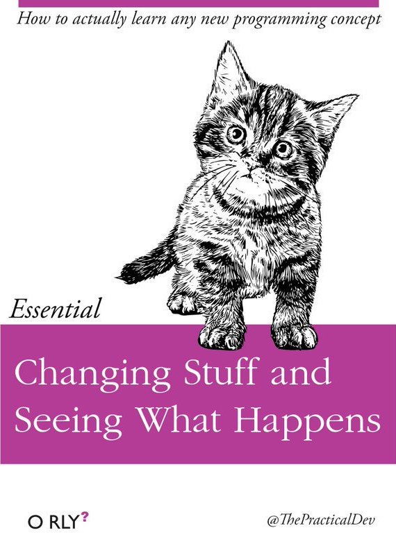

# __CODE TOOLKIT SPRING 2022__
# Week One Lecture Notes
### ___Technology as a Medium___
- SAAS, Software as a Service
- Bank Software aka B2B
- Advertising and _how they track you_ 
- Bots, Botnets, and Hacking for Fun and Profit
- Interactivity & Arting, with a Computer
## Computing, Outside of ___Computer Science___
### _Poetic Computing_
* Madeline Gannon, [*Mimus*](https://atonaton.com/mimus/)
* Design I/O, [*Mimic*](https://www.design-io.com/projects/mimic) & [*Connected Worlds*](https://www.design-io.com/projects/connectedworlds)
* Golan Levin, [*Ghost Pole Propagator I*](http://flong.com/archive/projects/gpp/index.html) & [*Ghost Pole Propagator II*](http://flong.com/archive/projects/gpp-ii/index.html)
* Kyle McDonald and Jonas Jongejan, [*Light Leaks*](https://vimeo.com/66167082)
### _Social Justice, Protests, Hacktivism, Jouralism, and Critical Hot Takes_ ___but also ART___
* Sam Lavigne, [Database of ICE employee LinkedIn accounts](https://www.theverge.com/2018/6/19/17480912/github-ice-linkedin-scraping-employees)
* The Markup, [COVID in Amazon Warehouses](https://github.com/the-markup/investigation-amazon-covid)
* Kyle McDonald, [Ethereum Emissions: A Bottom-up Estimate](https://kylemcdonald.github.io/ethereum-emissions/)
* Adam Harvey [CV Dazzle](https://cvdazzle.com)  
* The Critical Engineering Working Group [The Deep Sweep](https://criticalengineering.org/projects/deep-sweep/)
* Julian Oliver [Stealth Cell Tower](https://julianoliver.com/output/stealth-cell-tower.html)
## In-class Assignment: ___A crash course to git___
- Create a [Github](https://github.com) profile and link it to the P5js [Editor](https://editor.p5js.org) 
- Fork this Repo
- Install [git](https://git-scm.com)
- Clone your fork Repo
- Copy the _template_ folder and rename it to your chosen handle  
- add the folder to the repo and push to your upstream 
- perform a pull request to my repo
## __5-10 min break__
# Introductory Beep Boops 
### How we Work: The P5js Development Environment ("PDE")
We are going to read a lot of code this semester and we are going to code things together in class as a class.  I will prep examples and they will be hosted on the p5js editor or in the examples folder. 

___If I am ever going to fast or you have any questions please interrupt me and ask a question___
### Hello World
- [Hello World](https://editor.p5js.org/danzeeeman/sketches/yyrHi9CAJ)
#### __Discussion__: 
- _What does the word ___procedural___ mean to you?_
- _What does the word ___programmatic___ mean to you?_
- _What is a process?_
- _What is software?_
- _What is an algorithm?_
## Drawing with numbers
- [Hello Shapes](https://editor.p5js.org/danzeeeman/sketches/l21Ut52K6)
### 2D Primitives

- ```arc()```
    ```
    arc(50, 55, 50, 50, 0, HALF_PI);
    noFill();
    arc(50, 55, 60, 60, HALF_PI, PI);
    arc(50, 55, 70, 70, PI, PI + QUARTER_PI);
    arc(50, 55, 80, 80, PI + QUARTER_PI, TWO_PI);
    ```
- ```ellipse()```
    ```
    ellipse(56, 46, 55, 55);
    ```
- ```circle()```
    ```
    circle(30, 30, 20);
    ```
- ```line()```
    ```
    line(30, 20, 85, 75);
    ```
- ```point()```
    ```
    point(30, 20);
    point(85, 20);
    stroke('purple'); // Change the color
    strokeWeight(10); // Make the points 10 pixels in size
    point(85, 75);
    point(30, 75);
    ```
- ```quad()```
    ```
    quad(38, 31, 86, 20, 69, 63, 30, 76);
    ```
- ```rect()```
    ```
    rect(30, 20, 55, 55);
    ```
    ```
    rect(30, 20, 55, 55, 20);
    ```
- ```square()```
    ```
    square(30, 20, 55);
    ```
- ```triangle()```
    ```
    triangle(30, 75, 58, 20, 86, 75);
    ```
### The Screen is a Grid
- [Hello Grid](https://editor.p5js.org/danzeeeman/sketches/aiCnAxqRZ)

[Hello Transforms]()
### Transforms
- ```rotate()```
  ```
  translate(width / 2, height / 2);
  rotate(PI / 3.0);
  rect(-26, -26, 52, 52);
  ```
- ```scale()```  
  ```
  translate(width / 2, height / 2);
  rotate(PI / 3.0);
  scale(2.0)
  rect(-26, -26, 52, 52);
  ```
- ```translate()```
  ```
  translate(30, 20);
  rect(0, 0, 55, 55);
  ```  

- ```random()```
  ```
  for (let i = 0; i < 100; i++) {
    let r = random(50);
    stroke(r * 5);
    line(50, i, 50 + r, i);
  }
  ```
### Tweaking Things Is Essential 

## [Examples](https://p5js.org/examples/)

### Home Work
* Read Marshall McCluhan's [The Medium is the Message](pdfs/mcluhan.mediummessage.pdf)
* Read Lev Manovich's [The Language of New Media, Cambridge, MA: MIT Press, 2002. Chapter 1 (pages 18-55)](https://dss-edit.com/plu/Manovich-Lev_The_Language_of_the_New_Media.pdf)
* _Extra Credit Readings & Writings_ 
  * The Critical Engineering Working Group's [THE CRITICAL ENGINEERING MANIFESTO](https://criticalengineering.org) [pdf](https://criticalengineering.org/ce.pdf)
  * Watch Zach Lieberman's talk at EYE0 2012 * https://vimeo.com/47203759?t=38m22s
  * Read Casey Reas et al. [{Sofrware} Structures](https://artport.whitney.org/commissions/softwarestructures/text.html#structure)

