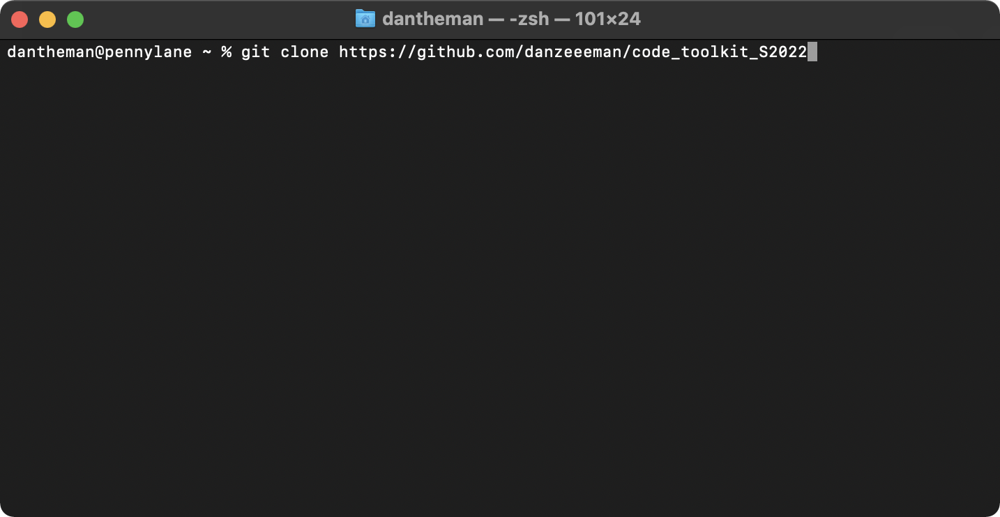
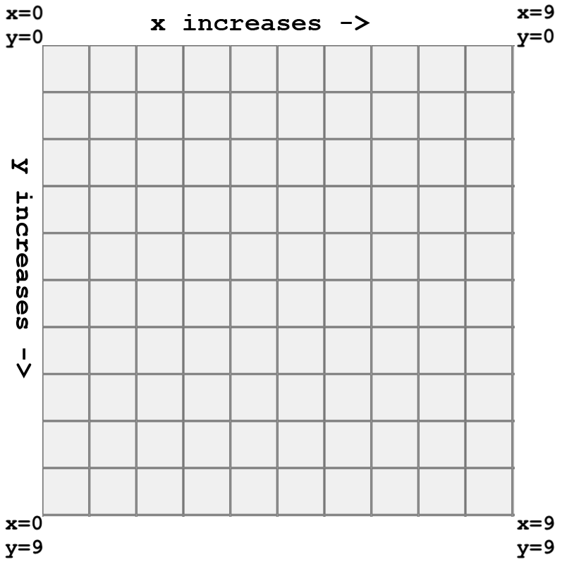

# __CODE TOOLKIT SPRING 2022__
# Week One Lecture Notes

## One on One
I want to schedule Virtual 1:Ones with everyone in the class periodically throughout the semester.  These informal chats will help me gage progress, help with confusion, and help me get to know each of you a bit better. 

## Office Hours
Office hours will be on demand this semester.  I'm usually available during the day except for some standing meetings I have at work at 12:30 and 1pm.  If you send me an email or slack me on our slack I will usually get back to you soon.  I basically live in front of a multiple computers so if I'm not getting back to you promptly its because I'm on a call or something (even then I'll reach out and tell you I'll be available soon probably).

## Slack
I invited you all to our slack and to our channel.  If I have missed anyone please let me know right now!  Please sign up as it is a way to contact me directly about issues with homework or readings. 
## ___Technology as a Medium___
- SAAS, Software as a Service
- Bank Software aka B2B
- Advertising and _how they track you_ 
- Bots, Botnets, and Hacking for Fun and Profit
- Interactivity & Arting, with a Computer
## Computing, Outside of ___Computer Science___
### _Poetic Computing_
* Madeline Gannon, [*Mimus*](https://atonaton.com/mimus/)
* Design I/O, [*Mimic*](https://www.design-io.com/projects/mimic) & [*Connected Worlds*](https://www.design-io.com/projects/connectedworlds)
* Golan Levin, [*Ghost Pole Propagator I*](http://flong.com/archive/projects/gpp/index.html) & [*Ghost Pole Propagator II*](http://flong.com/archive/projects/gpp-ii/index.html)
* Kyle McDonald and Jonas Jongejan, [*Light Leaks*](https://vimeo.com/66167082)
* Acne-studios-x-Robbie-Barrat, [Fall/Winter 2020](https://xrgoespop.com/home/acne-studios-x-robbie-barrat)
### _Social Justice, Protests, Hacktivism, Jouralism, and Critical Hot Takes but also art_
* Sam Lavigne, [Database of ICE employee LinkedIn accounts](https://www.theverge.com/2018/6/19/17480912/github-ice-linkedin-scraping-employees)
* The Markup, [COVID in Amazon Warehouses](https://github.com/the-markup/investigation-amazon-covid)
* Kyle McDonald, [Ethereum Emissions: A Bottom-up Estimate](https://kylemcdonald.github.io/ethereum-emissions/)
* Adam Harvey [CV Dazzle](https://cvdazzle.com)  
* The Critical Engineering Working Group [The Deep Sweep](https://criticalengineering.org/projects/deep-sweep/)
* Julian Oliver [Stealth Cell Tower](https://julianoliver.com/output/stealth-cell-tower.html)
## In-class Assignment: _A crash course to git_s
- Create a [Github](https://github.com) profile and link it to the P5js [Editor](https://editor.p5js.org) 
- Fork this Repo
  - Click the fork button
- On Windows 
  - Install [git](https://git-scm.com)
  - open git-bash [see screen shot]
  - go to cloning
- on Mac 
  - install [brew](https://brew.sh)
  - open terminal
    - 
  - install git
    - type ```brew install git``` into your terminal
  - go to cloning
- Clone your fork Repo to your home directory
- type into your terminal
```
git clone your_repo_url
```

Cloning a repository of code is basically making a copy but with 
- Copy the _template_ folder and rename it to your chosen name
```
git add --all
git commit -a -m "adding my homework folder where I will store all of my homework"
git push origin main
```
### we might run into a little issue here!


## __5-10 min break__
# Introductory Beep Boops 
### How we Work: The P5js Development Environment ("PDE")
We are going to read a lot of code this semester and we are going to code things together in class as a class.  I will prep examples and they will be hosted on the p5js editor or in the examples folder.

Download [Processing](https://processing.org/download)

- Install P5js Mode


Let's look around:
- play button
- stop button
- File > Open
- File > Examples

___If I am ever going to fast or you have any questions please interrupt me and ask a question___
## [Hello World](https://editor.p5js.org/danzeeeman/sketches/yyrHi9CAJ)

With p5js we start with:
```
function setup(){
  print("Hello World");
}
```
a ```function``` is a thing we will get into later (week 3).  But for now just know that the setup function gets automatically called by the p5js library when the page finishes loading.  

we call the ```print(string)``` function and pass in the string "Hello World"

this is the traditional first program you write as a programmer
## Drawing with numbers

- [Hello Shapes](https://editor.p5js.org/danzeeeman/sketches/l21Ut52K6)

Lets break down what's going on here:
```
// Setup gets called to kick off the program
function setup() {
  // Before we can start drawing we need to create the canvas 
  createCanvas(512, 512);
  // we can make it the window width and height by doing this
  // createCanvas(windowWidth, windowHeight);
  // we set a background color;
  background(255);
  //lets comment this out and see what happens
  //we turn off ugly stroke outlines
  noStroke()
  
  // Drawing a rectangle
  // we set the fill the magenta with some alpha 
  fill(255, 0, 255, 127);
  // we call the fill function and we set the fill color to magenta with some alpha 
  rect(40, 120, 120, 40);
  
  // Drawing an ellipse
  // we call the fill function and we set the fill color to yellow with some alpha 
  fill(255, 255, 0, 127);
  // we call the ellipse function and draw a ellipse which in this case is a circle because the sides are equal. 
  ellipse(50, 50, 80, 80);
  
  // Drawing a triangle
  // we call the fill function and we set the fill color to magenta with some alpha 
  fill(255, 0, 255, 127);
  // we call the triangle function and draw a triangle
  triangle(300, 100, 320, 100, 310, 80);
}
```

Lets look at the functions we use to draw shapes


```rect(x, y, width, height)```
```
createCanvas(512, 512);
fill(255, 0, 255);
rect(0, 0, 512, 512);
```

```ellipse(x, y, width, height)```
```
createCanvas(512, 512);
fill(255, 0, 255);
ellipse(0, 0, 512, 512);
```

```triangle(x1, y1, x2, y2, x3, y3)```
```
createCanvas(512, 512);
fill(255, 0, 255);
triangle(0, 0, 256, 512, 512, 0);
```

Let's look at this ```fill``` function that we keep calling.  Fill sets the fill color for our shapes.

```fill(r, g, b)```

```
fill(255, 0, 255);
```

```stroke(r, g, b)```
```
stroke(255, 255, 0);
```

```
function setup(){
  createCanvas(512, 512)
  fill(255, 0, 255);
  stroke(255, 255, 0);
  rect(0, 0, 256, 256);
  rect(256, 256, 256, 256);

  fill(255, 255, 0);
  stroke(255, 0, 255);
  rect(0, 256, 256, 256);
  rect(256, 0, 256, 256);
}
```

## The Screen is a Grid
- [Hello Grid](https://editor.p5js.org/danzeeeman/sketches/aiCnAxqRZ)

```
function setup(){
  createCanvas(512, 512);
  fill(255, 255, 0);
  stroke(255, 0, 255);
  rect(0, 0, 512, 512);
}
```

```
function setup(){
  createCanvas(512, 512);
  fill(255, 255, 0);
  stroke(255, 0, 255);
  rect(100, 100, 200, 200);
}
```

```
function setup(){
  createCanvas(512, 512);
  fill(255, 255, 0);
  stroke(255, 0, 255);
  rect(0, 0, 100, 100);
  rect(100, 0, 100, 100);
}
```

```
function setup(){
  createCanvas(500, 500);
  noStroke()  

  fill(255, 255, 0);
  rect(0, 0, 250, 250);
  
  fill(255, 0, 255);
  rect(250, 0, 250, 250);
  
  fill(255, 255, 0);
  rect(250, 250, 250, 250);
  
  fill(255, 0, 255);
  rect(0, 250, 250, 250);
}
```

## Loading Images 
```
function setup() {
  let img = loadImage('assets/laDefense.jpg');
  image(img, 0, 0);
}
```
As an introduction to next weeks topics I'm going to introduce variables.  Here we define a variable ```let img``` to hold the image that we want to load.  We call the ```loadImage(image_path)``` function and it returns the image which we store as the variable ```img```.

___did I just confuse everyone?___

## Home Work
* Read Marshall McLuhan's [The Medium is the Message](pdfs/mcluhan.mediummessage.pdf)
* _Extra Credit Readings & Watching_ 
  * The Critical Engineering Working Group's [THE CRITICAL ENGINEERING MANIFESTO](https://criticalengineering.org) [pdf](https://criticalengineering.org/ce.pdf)
  * Watch Zach Lieberman's talk at EYE0 2012 * https://vimeo.com/47203759?t=38m22s
  * Read Casey Reas et al. [{Sofrware} Structures](https://artport.whitney.org/commissions/softwarestructures/text.html#structure)
  * Check out 2 [examples](https://p5js.org/examples/)

