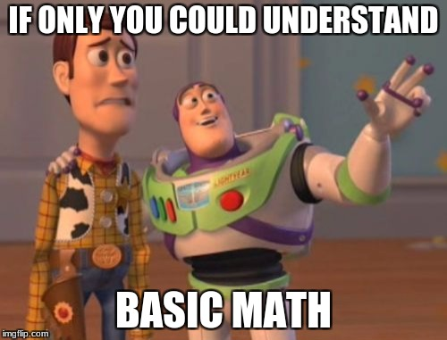
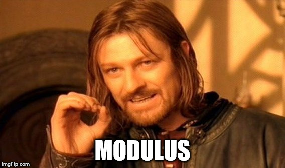

# Week 2 – Adding variance
* Variables
* Arithmetic (+, -, *, /, %)
* Introduction to ```random()```
## Review of what we've done so far
```
// the setup function gets called to kick everything off
function setup() {
  createCanvas(500, 500);
  noStroke()  

  fill(255, 255, 0);
  rect(0, 0, 250, 250);
  
  fill(255, 0, 255);
  rect(250, 0, 250, 250);
  
  fill(255, 255, 0);
  rect(250, 250, 250, 250);
  
  fill(255, 0, 255);
  rect(0, 250, 250, 250);
}
```
## Drawing with numbers
- [Hello Shapes](https://editor.p5js.org/danzeeeman/sketches/l21Ut52K6)
### The Screen is a Grid
- [Hello Grid](https://editor.p5js.org/danzeeeman/sketches/aiCnAxqRZ)

### _Who remembers algebra?_
```
y = m * x + b aka the formula for a line
a**2 + b**2 = c**2 aka Pythagorean Theorem
```
### _Did anyone take Physics?_
```
force = mass * acceleration 
```
### _Did anyone take Calculus?_
## Variables    
A variable is a way to store something in memory so you can access it later in your code. You will be using variables all of the time this semester.

You can store multiple types of data as a variable.
- strings ```"Yo Some Words"```
- floats ```0.01f```
- integers  ```5```
- and more complex data types (we'll get to that much later on in the course)

So lets talk about how you create a variable in code. The word for that is _declare_. 

This is how you _declare_ a variable in p5.js.

```
let x;
```
There are three places where you can _declare_ a variable

- Inside a _function_ or a _block_ which is called _local variables_
- In the definition of function parameters which is called _parameters_
- Outside of all _functions_ which is called _global variables_

local variable
```
    function setup()
    { 
        let x = 10;
    }
```
function parameter
```
    function setup()
    {
        print(getValue(100));
    } 

    function getValue(t)
    {
        return t*0.01;
    } 
```
global variable
```
    let x = 10;
    function setup()
    {
        let y = x*10;
        print(y);
    }
```


My advice is 

```
let makeItEasyToRead = 1;

let make_it_easy_to_read = 1;

let makeItMeanSomethingUnique = 1;

let make_it_mean_something_unique = 1;
```

lets look at some [code](https://editor.p5js.org/danzeeeman/sketches/kAGXxWYRf)

## Arithmetic

### basic math and some __funky__ _shit_
* add (+)
  * 1 + 1 = 2
  * 1++ = 2
* subtract (-)
  * 1 - 1 = 0
  * 1-- = 0
* multiply (*)
  * 2*2 = 4
  * 4*4 = 16
* divide (/)
  * 2/2 = 1
  * 1 / 2 = 0.5
* pow (**)
  * 2**2 = 4
  * 3**4 = 81 
* modulus (%) 
   
  *  1 % 4 = 1
  *  2 % 4 = 2
  *  3 % 4 = 3
  *  4 % 4 = 0
  *  5 % 4 = 1
  *  6 % 4 = 2
  
  ## ```random()```
  ```
    let r = random(50);
    stroke(r * 5);
    line(50, height/2, 50 + r, 0);
  ```
  [Random Sketch](https://editor.p5js.org/danzeeeman/sketches/poHo3Q87_)

# Homework
* Read Lev Manovich's [The Language of New Media, Cambridge, MA: MIT Press, 2002. Chapter 1 (pages 18-55)](https://dss-edit.com/plu/Manovich-Lev_The_Language_of_the_New_Media.pdf)
* Coding Assignment #1 __Solve LeWitt's Trapezoid__ 

