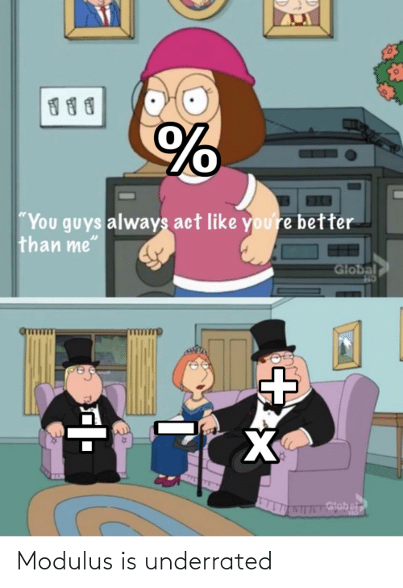

# Week 2 – Adding variance
## Review of what we've done so far
```
function setup(){
  //this creates the p5 canvas that lets us draw
  //the canvas is a grid of pixel we can manipulate 
  createCanvas(512, 512);
  //the print function allows us to print things to the console 
  print("Hello World")
}
function draw(){
  //background clears the screen with a specific color
  background(0, 0, 0);
  //fill sets the color we use when we draw
  fill(255, 0, 255);
  //draws a rectangle on the screen with a given x, y, width, height
  rect(0, 0, width, height);
}
```
_Who remembers algebra?_
```
y = m * x + b aka the formula for a line
a**2 + b**2 = c**2 aka Pythagorean Theorem
```
_Did anyone take Physics?_
```
force = mass * acceleration 
```
_Did anyone take Calculus?_
## Variables    
A variable is a way to store something in memory so you can access it later in your code. You will be using variables all of the time this semester.

You can store multiple types of data as a variable.
- strings ```"Yo Some Words"```
- floats ```0.01f```
- integers  ```5```
- and more complex data types (we'll get to that much later on in the course)

So lets talk about how you create a variable in code. The word for that is _declare_. 

This is how you _declare_ a variable in p5.js.
```
let x;
```
There are three places where you can _declare_ a variable

- Inside a _function_ or a _block_ which is called _local variables_
- In the definition of function parameters which is called _parameters_
- Outside of all _functions_ which is called _global variables_

local variable
```
    function setup()
    { 
        let x = 10;
    }
```
function parameter
```
    function setup()
    {
        print(getValue(100));
    } 

    function getValue(t)
    {
        return t*0.01;
    } 
```
global variable
```
    let x = 10;
    function setup()
    {
        let y = x*10;
        print(y);
    }
```


My advice is 

```
let makeItEasyToRead = 1;

let make_it_easy_to_read = 1;

let makeItMeanSomethingUnique = 1;

let make_it_mean_something_unique = 1;
```

lets look at some [code](https://editor.p5js.org/danzeeeman/sketches/QR1NPe1TI)

## Arithmetic

### basic math and some __funky__ _shit_
* add (+)
  * 1 + 1 = 2
  * 1++ = 2
* subtract (-)
  * 1 - 1 = 0
  * 1-- = 0
* multiply (*)
  * 2*2 = 4
  * 4*4 = 16
* divide (/)
  * 2/2 = 1
  * 1 / 2 = 0.5
* pow (**)
  * 2**2 = 4
  * 3**4 = 81 
* modulus (%) 
   
  
  *  1 % 2 = 1
  *  2 % 2 = 0
  *  2 % 4 = 2
  *  4 % 4 = 0
  *  3 % 4 = 3
  *  16 % 4 = 0
## functions() and methods()

functions allow you to break up your code into nice little blocks.  


### Transforms
- ```rotate()```
  ```
  translate(width / 2, height / 2);
  rotate(PI / 3.0);
  rect(-26, -26, 52, 52);
  ```
- ```scale()```  
  ```
  translate(width / 2, height / 2);
  rotate(PI / 3.0);
  scale(2.0)
  rect(-26, -26, 52, 52);
  ```
- ```translate()```
  ```
  translate(30, 20);
  rect(0, 0, 55, 55);
  ```  

- ```random()```
  ```
  for (let i = 0; i < 100; i++) {
    let r = random(50);
    stroke(r * 5);
    line(50, i, 50 + r, i);
  }
  ```

* ```yourOwnFunctions(p1, p2, p3)```

  ```
  function  yourOwnFunctions(p1, p2, p3){
    return ((p1*p2)+p3)/p2
  }
  ```
* ```yourOwnFunction(parameters)```

  ```
  function  yourOwnFunctions(p){
    return ((p.p1*p.p2)+p.p3)/p.p2
  }
  ```


# Homework
* Read Lev Manovich's [The Language of New Media, Cambridge, MA: MIT Press, 2002. Chapter 1 (pages 18-55)](pdfs/Manovich-Lev_The_Language_of_the_New_Media.pdf)
* Coding Assignment #1 __Solve LeWitt's Trapezoid__ 

