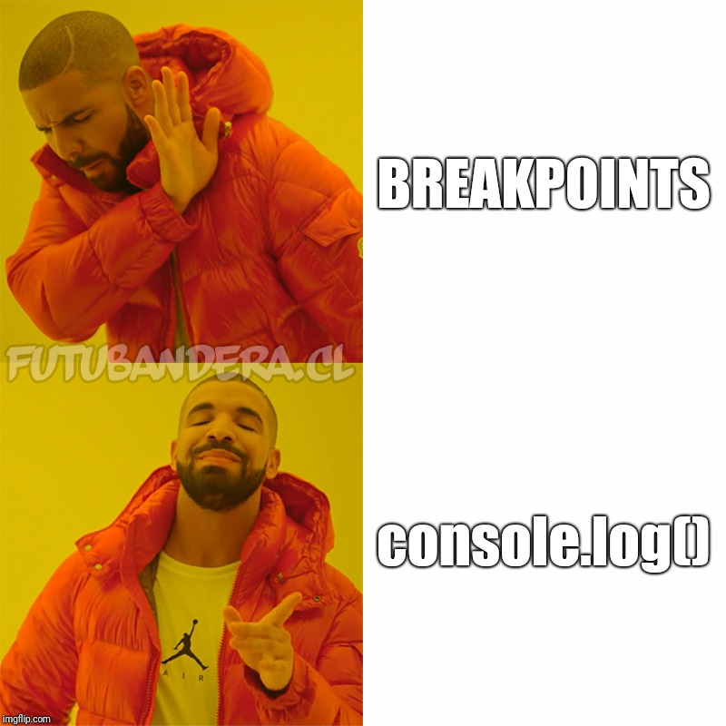
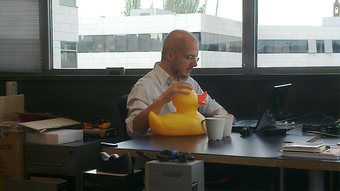
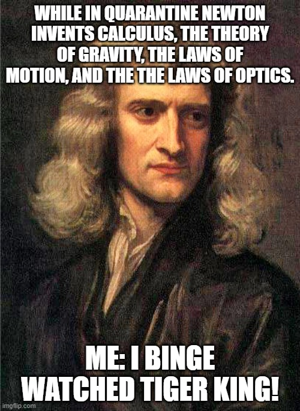

# Week 3 – Debugging & Adding interactivity

## Frames
__```function draw()```__
This function gets called at every frame.  Think of a frame as a snapshot in time.  It allows you to 

## Debugging
Figuring out what is wrong and how to fix it is an important skill.  Your best tool to examine what's going on in your code in an instant is to print to the console.  

___The joys of ```console.log()``` and ```print()``` and ```breakpoints```___

## Rubber Duck Debugging


### ___talk it out___
One way of debugging is to talk out the problem.  

### Debuggings

let's take this code that won't run.  And try to run it. 

```
let value_x = 0;
let value_y = 10;
let value_z = 5;
function setup(){
    createCanvas(512, 512);
    value_y = value_y / value_x;
    value_x = 100;
}

function draw(){
    print(computeX());
}

function computeX(){
    return (value_x+value_y+value_z)/3.0;
}

```
[Error](https://editor.p5js.org/danzeeeman/sketches/RYFoFP0ke)

lets try and debug it?

## Mouse Interaction

```mouseX, mouseY``` are some variables that p5.js exposed for you that hold the value of the mouse's current x and y position. 

lets look at how we can use it?

```
function setup() {
  createCanvas(400, 400);
}

function draw() {
  stroke(0, 0, 0, 100);
  line(mouseX, 0, mouseX, width);
  line(0, mouseY, height, mouseY);
}
```
[mouse_lines](https://editor.p5js.org/danzeeeman/sketches/zI8kWXTMH)s

_a little bit of calculus_


Say you wanted to calculate the _acceleration_ of your mouse movements and tie that to your program.  You also want to calculate the _velocity_ of the mouse movements. 

So what is the velocity of an object? It's the _derivative_ of the position function.

```
v_x(t)=d/dt(x(t))
v_y(t)=d/dt(y(t))
```
so really whats a _derivative_?  Its the difference between the output of a function with respects to time.  It's the difference over time. 

_How can we compute the difference of position over time?_

Well if we know the position of the mouse at each frame given as ```mouseX``` and ```mouseY``` we can store those values and use them to compute the difference in position also known as the _velocity_ and then store that value to compute the difference in _velocity_ or the _acceleration_ of the mouse;

```
// position cache
let previous_mouseX = 0;
let previous_mouseY = 0;
//velocity
let velocityX = 0;
let velocityY = 0;
let previous_velocityX = 1;
let previous_velocityY = 1;
//acceleration
let accelX = 0;
let accelY = 0;
let previous_accelerationX = 1;
let previous_accelerationY = 1;
// min max 
let maxVelocity = 0;
let maxAccel = 0;
// should really make it max int
let minVelocity = 100;
// should really make it max int
let minAccel = 100;
function setup(){
  createCanvas(512, 512);
}

function draw(){
    calcVelocity();
    calcAcceleration();
    cachePrevious();
    drawMotion();
}

function calcVelocity(){
    velocityY = mouseY - previous_mouseY;
    velocityX = mouseX - previous_mouseX;
    maxVelocity = max(velocityX, maxVelocity);
    maxVelocity = max(velocityY, maxVelocity);
    minVelocity = min(minVelocity, velocityX);
    minVelocity = min(minVelocity, velocityY);
}
function calcAcceleration(){
    accelX = velocityX - previous_velocityX;
    accelY = velocityY - previous_velocityY;  
    maxAccel = max(accelX, maxAccel);
    maxAccel = max(accelY, maxAccel);
    minAccel = min(minAccel, accelX);
    minAccel = min(minAccel, accelY);
}
function cachePrevious(){
    previous_mouseX = mouseX;
    previous_mouseY = mouseY;
    previous_velocityX = velocityX;
    previous_velocityY = velocityY;
}

function drawMotion(){
  background(0, 0, 0);
  fill(255, 255, 0);
  rect(0, 0, map(velocityX, minVelocity, maxVelocity, 0, 512), height/4);
  fill(255, 0, 255);
  rect(0, height/4, map(velocityY, minVelocity, maxVelocity, 0, 512), height/4);
  fill(255, 255, 0);
  rect(0, 2*height/4, map(accelX, minAccel, maxAccel, 0, 512), height/4);
  fill(255, 0, 255);
  rect(0, 3*height/4, map(accelY, minAccel, maxAccel, 0, 512), height/4);
}
```

## map() 
```map()``` is a very useful function.  It is a shortcut for this mathematical operation that takes a value in a range between two numbers ```[input_start, input_stop]``` and remaps it to a value in another range defined by two numbers ```[output_start, output_stop]```.

```
function map(value, input_start, input_stop, output_start, output_stop) {
    return output_start + (output_stop - output_start) * ((value - input_start) / (input_stop - input_start));
}
```

So in other words it remaps a value from one range to another.  So if I had the output of a sin wave going from ```[-1, 1]``` and wanted to use that value draw a rectangle along the x axis of my window I could do this:

```
let value = sin(frameCount%500/500);
let mapped_value = map(value, -1, 1, 0, width);
rect(mapped_value, height/2, 50, 50);
```


### Home Work
* Read [Introduction to Shape Grammars](pdfs/MIT4_540F18_qa1.pdf)
* Coding Assignment #2a : Create a generative pattern
  * Experiment with 2D transforms such as scaling, rotation, mirroring
  * Iterate on your designs
  * Use Plenty of Variables
* Coding Assignment #2b : Make your pattern respond to the mouse input (button click and or position)
