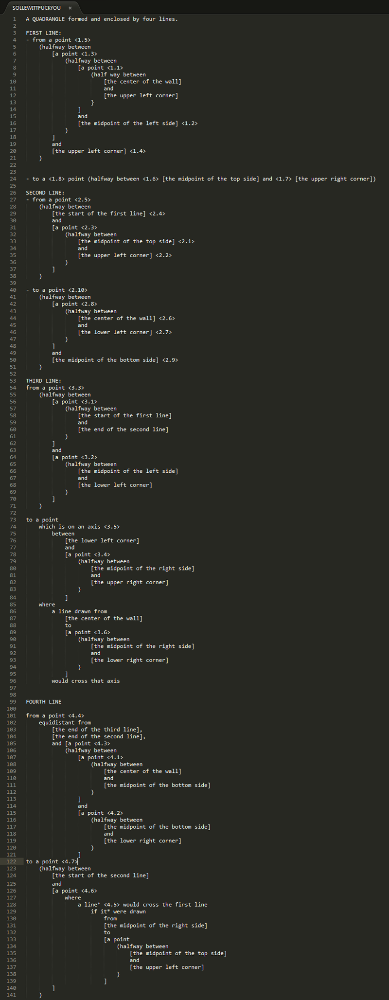
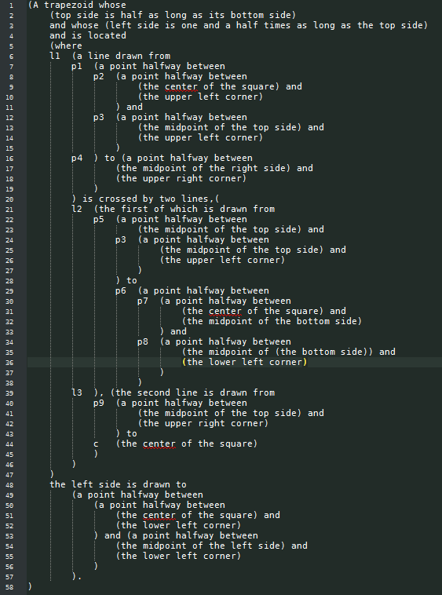

# Cool Stuff Alert 

[srcsnap](https://srcsnap.glitch.me) by someone you should know about artist [Lingdong Huang](https://lingdong.works) aka Lingdong.  His work is amazing! [fishdraw](https://fishdraw.glitch.me) [doodle-place](https://doodle-place.glitch.me) [trashscape](https://vimeo.com/204271262)

So srcsnap works like this: 

every time you take a screenshot of your project, srcsnap takes a snapshot of all your code too, and associate it with the screenshot. it organizes your screenshots in a nice list in the menubar: your code can "time travel" back to the very moment when you took each of the screenshots.

please try it out with your work and report bugs!

## Review of what we've done so far
```
// the setup function gets called to kick everything off
function setup() {
  createCanvas(500, 500);
  noStroke()  

  fill(255, 255, 0);
  rect(0, 0, 250, 250);
  
  fill(255, 0, 255);
  rect(250, 0, 250, 250);
  
  fill(255, 255, 0);
  rect(250, 250, 250, 250);
  
  fill(255, 0, 255);
  rect(0, 250, 250, 250);
}
```
### Drawing with numbers
- [Hello Shapes](https://editor.p5js.org/danzeeeman/sketches/l21Ut52K6)
### The Screen is a Grid
- [Hello Grid](https://editor.p5js.org/danzeeeman/sketches/aiCnAxqRZ)
- 
### ```function preload()```

```function preload()``` get called at the start of the program automatically by p5js. 

### ```function setup()```

```function setup()``` is called directly after ```function preload()```

### ```createCanvas(width, height)```

In the ```function setup()``` code block ```{}``` we must call ```createCanvas(width, height)``` to create a canvas to draw into.

### Variables 
```
let makeItEasyToRead = 1;

let make_it_easy_to_read = 1;

let makeItMeanSomethingUnique = 1;

let make_it_mean_something_unique = 1;
```

- ```width``` ```height``` are Variables provided by p5js that describe the canvas width and height. 
- ```mouseX, mouseY``` are some variables that p5.js exposed for you that hold the value of the mouse's current x and y position. 
- ```pmouseX, pmouseY``` are some variables that p5.js exposed for you that hold the value of the mouse's previous x and y position. 
- ```frameCount``` holds the current frame number

[Grid](https://editor.p5js.org/danzeeeman/sketches/kAGXxWYRf)
## Arithmetic
* add (+)
  * 1 + 1 = 2
  * 1++ = 2
* subtract (-)
  * 1 - 1 = 0
  * 1-- = 0
* multiply (*)
  * 2*2 = 4
  * 4*4 = 16
* divide (/)
  * 2/2 = 1
  * 1 / 2 = 0.5
* pow (**)
  * 2**2 = 4
  * 3**4 = 81 
* modulus (%) 
  *  1 % 4 = 1
  *  2 % 4 = 2
  *  3 % 4 = 3
  *  4 % 4 = 0
  *  5 % 4 = 1
  *  6 % 4 = 2

### ```random()```
[Random Sketch](https://editor.p5js.org/danzeeeman/sketches/poHo3Q87_)]

```random(max_value)``` returns a random number from 0 to the ```max_value```


### ```function draw()```
```function draw()``` gets called at every frame automatically by p5js.
[Example](https://editor.p5js.org/danzeeeman/sketches/x1UXy-OhP)


```rotate(degree)```

```
function setup() {
  createCanvas(512, 512);
  frameRate(25);
}


function draw() {
  //background(255);
  push();
  translate(width/2, height/2);
  rotate(radians(frameCount));
  let scale_x = sin(map(frameCount%1000, 0, 1000, 0, 2*PI))*3;
  let scale_y = cos(map(frameCount%1000, 0, 1000, 0, 2*PI))*3;
  scale(scale_x, scale_y);
  rect(-25, -25, 50, 50);
  pop();
}
```


```scale(x, y)```

```
function setup() {
  createCanvas(512, 512);
  frameRate(25);
}


function draw() {
  background(255);
  push();
  translate(width/2, height/2);
  let scale_x = sin(map(frameCount%1000, 0, 1000, 0, 2*PI))*3;
  let scale_y = cos(map(frameCount%1000, 0, 1000, 0, 2*PI))*3;
  scale(scale_x, scale_y);
  rect(-25, -25, 50, 50);
  pop();
}
```

```translate(x, y)```

```
function setup() {
  createCanvas(512, 512);
}


function draw() {
  background(255);
  push();
  translate(width/2, height/2);
  rect(-25, -25, 50, 50);
  pop();
}
```

### Map
```
let value = sin(frameCount%500/500);
let mapped_value = map(value, -1, 1, 0, width);
rect(mapped_value, height/2, 50, 50);
```

# Week 4 – Conditional more Interaction!
* Conditionals
* Keyboard interaction * Motion
* Keeping Time 

First, we will learn how to use conditionals so that instead of the continuous change of mouse movement, you can create movement that is discrete and discontinuous.

Second, we will build on our use of variables and P5js's interactive mode to create things that move on their own, not only as directly controlled by the mouse.


## Background
Last week we saw how to make interactive compositions, but they were always moving in continuous, connected ways. Colors that changed as smooth gradients, shapes that moved along with the mouse, or that left smooth trails.

Today we will see how to work with one of the fundamental principles of digital media with is how to work with discontinuity, or on/off relationships. This kind of behavior is often described as discrete. (Not to be confused with "discreet"!)

In 1997, the net artist John Simon created a project called [Every Icon](http://www.numeral.com/appletsoftware/eicon.html). This conceptual work enacts a play of combinatorics by starting with the first (top, left) pixel of a 32 by 32 grid, and advances in sequence, creating every possible combination of pixels, or in other works, every possible icon.

This work emphasizes the way that all digital images are created not as smooth strokes, continuous marks, or smooth lines, but rather always as grids of pixels, always turned either on or off.
To similar ends but in a more poetic and ironic way, the artist Hito Steyerl, in her documentary [How Not to be Seen: A Fucking Didactic Educational .MOV File](https://www.artforum.com/video/hito-steyerl-how-not-to-be-seen-a-fucking-didactic-educational-mov-file-2013-51651), explores (and blurs) the boundary between the analog and digital, between the physical world and the world of digital representations, or in other words, between the smooth and the discrete.

Let's keep all of this in the back of our minds as we explore the logic of discrete on/off structures today and dive in to binary logic.

## ```mouseIsPressed``` and ```keyIsPressed```
In addition to ```mouseX``` and ```mouseY```, P5js gives us some other built-in variables that we can use to create user interaction:
- ```mouseIsPressed``` tells us if the mouse is currently being pressed, and
- ```keyIsPressed``` tells us if the any key is currently being pressed

But what is if? So far, variables have only had numeric values. How can a variable tell us "if" something?
These variables are of a new kind of value. We say that they are a new type, and it is called ```Boolean```.
Just like with the numerical values and variables that we have been using, ```Boolean``` variables can be used whenever we want to keep track of something with only two possible values: yes or no, on or off, visible or hidden. Their value is always only either True or False. So you would use them like this:
```
let isDrawing = false;
```
or like this:
```
let is_drawing = true;
```
Notice that I'm writing ```true``` and ```false``` as valid javascript. That is because they are actual values that you can use in your code just like numbers, which in technical jargon we call ```literals```. So far we have seen numerical literals like 0, 1, 2, 10, 300, etc, and string literals like "hello". Now we have the Boolean literals ```true``` and ```false```. You can see this if you use print() to display the value of mousePressed:
```
function draw(){
    print(mouseIsPressed);
}
```
But how do we actually use these variables?

## Conditionals
Conditionals are ways of asking if something is happening or not, and to allow our code to have different behavior in each case.
Your code can now be more than one simple set of top-down instructions, and can instead have the possibility of doing different things depending on various variables, calculations, and user actions.
A note on pseudocode. (Pronounced, "SOO-doh code".) So far, all the code that I've shown you has been valid P5js syntax. You could copy/paste it into the PDE and it would run. Now we will start talking about a thing called pseudocode. Pseudocode is basically plain English, but with some bits of valid code in it. There are not hard and fast rules about valid pseudocode. Rather, it is a way of writing out an algorithm in English with bits of actual code in it. It is a way to describe an algorithm and work it out, without implementing it yet.
(Pseudocode will always be indicated with a gray background and a thin side border. Remember, this is to help us understand, but you are not able to copy/paste it into the PDE.)
If the answer to some question is Yes:
    then run some commands
As an example, let's start with this code that draws a circle in the middle of the window:
```
function setup(){
    createCanvas(600,600);
}

function draw(){
    background(255);
    ellipse(300,300, 50,50);
}
```
Now, let's draw this circle only if the user is pressing the mouse by adding this new syntax for conditionals:

```
function setup(){
    createCanvas(600,600);
}

function draw(){
    background(255);
    if(mouseIsPressed){
        ellipse(300,300, 50,50);
    }
}
```

now lets look at some boolean operators:

```&&``` know as and

```
function setup(){
    createCanvas(600,600);

function draw(){
    background(255);
    if(mouseIsPressed && keyPressed){
        ellipse(300,300, 50,50);
    }
}
```

```||``` know as or

```
function setup(){
    createCanvas(600,600);
}

function draw(){
    background(255);
    if(mouseIsPressed || keyPressed){
        ellipse(300,300, 50,50);
    }
}
```

You can also compare numbers to create boolean operators: 

```<``` less than


```
function setup(){
    createCanvas(600,600);
}

function draw(){
    background(255);
    if(mouseX < width/2){
        ellipse(width/2,width/2, 50,50);
    }
}
```


```>``` greater than
  ```
function setup(){
    createCanvas(600,600);
}

function draw(){
    background(255);
    if(mouseX > width/2){
        ellipse(width/2,width/2, 50,50);
    }
}
```

```===``` equal to
```
let x;
let y;
function setup(){
    createCanvas(600,600);
    x = width/2;
    y = width/2;
}

function draw(){
    background(255)
    if(frameCount%10 === 1){
        x = (x + width/2/100) % width;
    }
    ellipse(x,y, 50,50);
}
```

```<=``` less than or equal
```
function setup(){
    createCanvas(600,600);
}

function draw(){
    background(255);
    if(mouseX <= width/2){
        ellipse(width/2,width/2, 50,50);
    }
}
```
```>=``` greater than or equal

```
function setup(){
    createCanvas(600,600);
}

function draw(){
    background(255);
    if(mouseX >= width/2){
      ellipse(width/2,width/2, 50,50);
    }
    rect(0, 0, 100, 100);
}
```

```!=``` not equal to

## NOW YOU TRY

### Take 25 mins and create a pattern of shapes that changes when my mouse position enters a certain part of the screen. 

## BREAK
## OR ELSE!!!

```
function setup(){
    createCanvas(600,600);
}

function draw(){
    background(255);
    if(mouseX >= width/2){
        ellipse(width/2,width/2, 50,50);

    }else{
        ellipse(0,0, 50,50);
    }
}
```

```
function setup(){
    createCanvas(600,600);
}

function draw(){
    background(255)
    if(frameCount%200 < 100){{
        ellipse(width/2,width/2, 50,50);
    }else{
        ellipse(width/4,width/2, 50,50);
    }
}
```

Let's work on another example starting with the following pseudocode:

  If the mouse is on the left of the screen
    then draw a circle
  Otherwise, if it is in the middle of the screen
    then draw a square
  Otherwise, if it is on the right of the screen
    then draw a triangle
In this case, to get more specific, we could say this in two different ways that are both logically equivalent:
  If mouseX < 200
    then draw a circle
  If mouseX >= 200 and mouseX < 400
    then draw a square
  If mouseX >= 400
    then draw a triangle
  If mouseX < 200
    then draw a circle
  Otherwise, if mouseX < 400
    then draw a square
  Otherwise
    draw a triangle
Here on the left, we are being explicit about each logical case. While on the right side, we are using this "otherwise" idea to say: "if mouseX is less than 200, then draw a circle, otherwise (if it is not less than 200) if it is less than 400, then draw a square."
This idea of "otherwise if" has its own syntax, and that is else if. We would write the above right-side example in the following way:
```
function setup(){
    createCanvas(600,600);
    noFill();
    rectMode(CENTER);
}
 
function draw(){
    background(255);
    if(mouseX < 200){
      ellipse(300,300, 50,50);
    }else if(mouseX < 400){
        rect(300,300, 50,50);
    }else{
      triangle(300,275, 325,325, 275,325);
    }
}
```
This new syntax ```else if``` uses the fact that the first part of the conditional (mouseX < 200) is False, and then adds another question. So it's like saying "Otherwise, since mouseX is greater than 200, if it is less than 400, then draw a square." And in this example, the final else now says "Otherwise, since mouseX is greater than 400, then draw triangle."
Note that the order is important here. For example, think about what would happen if we switched the order of the first two conditionals. If you wrote the following:
```
if(mouseX < 400){
    ellipse(300,300, 50,50);
}else if(mouseX < 200){
    rect(300,300, 50,50);
}else{
    triangle( 300,275, 325,325, 275,325);
}
```
The square would never get drawn. Why? What would make the first if statement False? If mouseX is greater than or equal to 400. But if this is the case, it could never be less than 200.
If ```else if``` seems confusing to you, that's OK. It is confusing. Even expert programmers get tripped up about these kinds of logical statements all the time, and they are often the source of time-consuming and expensive bugs. Fortunately, you can write this example in a way that is more clear and readable, and that is also logically equivalent — based on the left-side pseudocode above, like this:
```
function setup(){
    size(600,600);
    noFill();
    rectMode(CENTER);
}
 
function draw(){
    background(255);
    if(mouseX < 200){
      ellipse(300,300, 50,50);
    }

    if (mouseX >= 200 && mouseX < 400){
      rect(300,300, 50,50);
    }

    if (mouseX >= 400){
      triangle( 300,275, 325,325, 275,325);
    }
}
```
This example is totally clear and explicit about each quesiton that you are asking, and is probably the easiest and most understandable way to implement this.
As a final example, let's stitch together several Boolean variables to ask a slightly more complicated question.

Let's start again with some pseudocode:

Draw a small square
If the mouse is inside this square
    then draw a circle
Start with the basics:
```
function setup(){
    createCanvas(600,600);
    noFill();
    rectMode(CENTER);
}
 
function draw(){
    background(255);
    rect(300,300, 50,50);
}
```
Now before we try to implement the conditional, let's diagram what's going on here:


With these coordinates in mind, let's refine our pseudocode:

  Draw a small square
  If mouseX is greater than 275 and less than 325, and
     mouseY is greater than 275 and less than 325,
    then draw a circle
If that's not totally clear, pause for a second and think through the logic of those comparisons to see how that pseudocode describes a check that the mouse is inside the above box.
Moving forward from there, we can now implement a conditional for this description:
```
function setup(){
    createCanvas(600,600);
    noFill();
    rectMode(CENTER);
}
 
function draw(){
    background(255);
    rect(300,300, 50,50);
    if(mouseX > 275 && mouseX < 325 && mouseY > 275 && mouseY < 325){
        ellipse(300,300, 50,50);
    }
}
```
Note that you must write mouseX twice. In other words, javascript does not allow you to say something like this:

  275 < mouseX < 325 # INVALID! Sorry :(
You must write it out as:
  if(mouseX > 275 && mouseX < 325)
In other words, our Boolean comparison operators are binary operators, meaning that they only take two arguments.
If you'd like, if it is more clear to you, you could write it like this:

  (275 < mouseX && mouseX < 325)
which is equivalent (note the change from > to <). Personally I find this more confusing, but it may look nicer to your eye.
Keyboard interaction
So far we've seen how you can use the special P5js variable ```keyPressed``` to let the user press any key to trigger a conditional action. But this only tells us if any ```key``` is being pressed or not. What if we want to get more specific and create code that responds to specific keys?

Fortunately, P5js offers us another special variable just for this purpose: ```key```

```
// Click any key to display it!
// (Not Guaranteed to be Case Sensitive)
function setup() {
  fill(245, 123, 158);
  textSize(50);
}

function draw() {
  background(200);
  text(key, 33, 65); // Display last key pressed.
}
```
### try this out!

With this variable, we are now working with a variable type that I have mentioned before called a string: a bit of text surrounded in single or double quotes. For example: 'a' or "b". You can read more about strings in the P5js reference, or in the javascript reference.

Like everything in javascript and P5js, strings are case-sensitive, so:

print('a' === 'a') # would print true, but

print('A' === 'a') # would print false.

Let's add to our example above:

```
function setup(){
    createCanvas(600,600);
}

function draw(){
    background(255);
    if(keyPressed){
        if(key === 'e'){
            ellipse(300,300, 50,50);
        }
    }
}
```

Note that I have added a new if statement inside the previous if statement. Programmers call this a nested if statement, because one is inside the block of another. It might look complicated, but hopefully if you think carefully about the logic, it is really simple. Let's think about it with pseudocode:
  If any key is being pressed,
    if that key is a lowercase 'e'
      then draw an ellipse.
Now where this gets tricky is that there are multiple ways to write this same logic. These ways are all valid, and you can use whichever is more clear and readable for you.

In reading that pseudocode, you might have gotten the impression that I could also have written it like this:

  If any key is being pressed,
    and that key is a lowercase 'e'
      then draw an ellipse.
and that would make perfect sense. They are logically equivalent. In fact, I could implement that pseudocode in P5js syntax, and it would also work perfectly well:
```
function setup(){
    createCanvas(600,600);
}

function draw(){
    background(255);
    if(keyPressed && key === 'e'){
        ellipse(300,300, 50,50);
    }
}
```
Use whichever form makes more sense to you and is easier for you to translate back-and-forth from your natural langauge to P5js syntax. The important thing to understand is that nesting if statements is kind of like and in that both conditional parts must be True.
Now let's expand on that example and see if you prefer one method or the other. What if we want to add a second key command to draw a square?
```
function setup(){
    createCanvas(600,600);
    rectMode(CENTER); # Adding this back for clarity
}

function draw(){
    background(255);
    if(keyPressed && key === 'e'){
      ellipse(300,300, 50,50);
    }

    if(keyPressed && key === 'r'){
      rect(300,300, 50,50);
    }
}
```
Adding more key commands would simply repeat that pattern. And maybe now you can see here why writing it this way for many key commands might be a little bit annoying. You have to add that keyPressed and check every time. Programmers usually hate redundancy like this and prefer to write things only once if possible, as it makes code less prone to errors.
Let's change it back to the previous style. Making a change like this is called refactoring. This is a fancy word that programmers like to use that just means re-writing code in a way that is equivalent and usually clearer or more efficient. So let's refactor this example:

```
function setup(){
    createCanvas(600,600);
    rectMode(CENTER); # Adding this back for clarity
}

function draw(){
    background(255);
    if(keyPressed){
        if(key === 'e'){
            ellipse(300,300, 50,50);
        }
        if(key === 'r'){
            rect(300,300, 50,50);
        }
    }
}
```
With this style, you are only checking that they key is pressed once, and if that is True, you have a series of nested if statements that then check which character was pressed.
Events
In addition to these conditionals using keyPressed and key, there is even an important third way of handling keyboard interaction. Try running the following code and make very quick key presses:

```
function setup(){
    createCanvas(600,600);
    rectMode(CENTER); # Adding this back for clarity
}

function draw(){
    background(255);
    if(keyPressed){
        ellipse( random(0,width),random(0,height), 50,50 );
    }
}
```

My goal was to draw a single circle at a random location each time a key is pressed. But one key press will likely draw many circles. That's because the code is responding to a single key press more than once. Because the frame rate is going fast relative to human reflexes, it appears that the user has pressed the key on multiple frame renderings, or in other words, during multiple executions of the draw() block.
Another problematic example would be if you slow down the framerate:

```
function setup(){
    createCanvas(600,600);
    rectMode(CENTER); # Adding this back for clarity
}

function draw(){
    background(255);
    if(keyPressed){
        ellipse(300,300, 50,50 );
    }
}
```
This is an exagerated example, but it shows that when you are only checking for key presses inside the draw() block, it is possible that you may not respond to all of them. By pressing keys more quickly than the frame rate refreshes, you are causing P5js to "miss" your action. When the frame is being rendered, you are not pressing the key, you are essentially pressing the key between frames.

These may be behaviors that you want. But if not, there is another option.

A new function from p5js:

```
function keyPressed(){
    # commands in here
}
```

This special block is triggered exactly once, every single time a key is pressed. That means that you don't have to worry about it not being called, and you don't have to worry about it being called more than once.
Also, inside this new block (which must always be global, outside all other blocks), you do not need to check if keyPressed is True. You know that your code is responding to one single key press.

This style of interactive programming is called event handling because your code is handling, or responding to, an event that the user triggers. This is an important part of any game development or user interface coding.

Let's look at our previous example implemented in this way:

```
function setup(){
  createCanvas(600,600);
  rectMode(CENTER); # Adding this back for clarity
}

function draw(){
  background(255);
}

function keyPressed(){
  if(key === 'e'){
    ellipse(300,300, 50,50);
  }

  if(key === 'r'){
    rect(300,300, 50,50);
  }
}
```

Sidenote: There is a similar pattern here for the mouse. The ```mousePressed()``` function is also valid syntax and would be used in a similar way:
```
function setup(){
  createCanvas(600,600);
  rectMode(CENTER); # Adding this back for clarity
}

function draw(){
  background(255);
}

function mousePressed(){
  ellipse(300,300, 50,50);
}
```
Making things move
Changing topics, let's look at how we can make things move on their own, instead of only moving in response to mouseX and mouseY, as well as mouse and key presses.

This is not a complicated topic and only brings together several things we've already seen, namely: variables, arithmetic, and frameRate.

Let's begin with the simple example that we've been starting with:

```
function setup(){
  createCanvas(600,600);
  rectMode(CENTER) # Adding this back for clarity
}

function draw(){
  background(255);
  ellipse(300,300, 50,50);
}
```
Now if we want that circle to move side to side, what do we need to add? We want it's position to change and to "vary" ... so we'll add a variable:

```
let circle_x = 300;
function setup(){
  createCanvas(600,600);
  rectMode(CENTER); # Adding this back for clarity
}

function draw(){
  background(255);
  ellipse(circle_x, 300, 50,50);
}
```
Just by itself, this change isn't going to make the circle move. How could we do that? What we've seen so far would be to use something like mouseX. So we could maybe try to modify draw() like this:

```
let circle_x = 0;
function setup(){
  createCanvas(600,600);
  rectMode(CENTER); # Adding this back for clarity
}

function draw(){
  background(255);
  circle_x = mouseX;
  ellipse(circle_x, 300, 50,50);
}
```

Let look at what we where doing last week with moving a shape across the screen:

```
let circle_x = 300;
let circle_width = 50;
function setup(){
    createCanvas(600,600);
    stroke(50,50,150);
    fill(200,200,255);
}

function draw(){
    background(255);
    ellipse(circle_x,300, circle_width,circle_width);
    circle_x = circle_x + 1;
    if(circle_x + circle_width/2 > width){
      circle_x = -circle_width/2;
    }
}
```

Remember from last class when someone asked if we could make the box bounce off the wall?

Let's get a little more complicated. What if we don't want the circle to re-appear on the other side, but rather to "bounce" off the wall of the window? Now, instead of only moving to the right, sometimes we'll want the shape to move to the left. In other words, we want the direction of the circle to change. And when we want something to change, what do we need?

A variable.

So let's add a new variable for the direction of the circle:
```
let circle_x = 300;
let circle_width = 50;
let circle_direction = 1;
function setup(){
    createCanvas(600,600);
    stroke(50,50,150);
    fill(200,200,255);
}

function draw(){
    background(255);
    ellipse(circle_x,300, circle_width,circle_width);
    circle_x = circle_x + circle_direction;
    if(circle_x + circle_width/2 > width){
      circle_x = -circle_width/2;
    }
}
```
So far nothing has changed. I've merely swapped in a variable for a hard-coded value. But now, instead of changing the position of the circle when it hits the wall, I want to change the direction. Like this:
```
let circle_x = 300;
let circle_width = 50;
let circle_direction = 1;
function setup(){
    createCanvas(600,600);
    stroke(50,50,150);
    fill(200,200,255);
}

function draw(){
    background(255);
    ellipse(circle_x,300, circle_width,circle_width);
    circle_x = circle_x + circle_direction;
    if(circle_x > width){
      circle_direction = -1;
    }
}
```
Great. But now it disappears off the left side. How do we fix this? Do we need a new variable? To answer that, ask yourself: is anything new is changing? No, nothing new is changing, so we don't need a new variable. But we want to change when and how that variable changes. In order to do that, there is another question that we want to ask and respond to. Let's work through the pseudocode:

  Draw a circle at location circleX
  Increment the value of circleX by 1
  If the circleX > width
    then change the increment to -1
And how do we want to modify this?
  Draw a circle at location circleX
  Increment the value of circleX by 1
  If the circleX > width
    then change the increment to -1
  If the circleX < 0
    then change the increment to 1
Looks like we need another conditional. Let's add that:
```
let circle_x = 300;
let circle_width = 50;
let circle_direction = 1;
function setup(){
  createCanvas(600,600);
  stroke(50,50,150);
  fill(200,200,255);
}

function draw(){
  background(255);
  ellipse(circle_x,300, circle_width,circle_width);
  circle_x = circle_x + circle_direction;
  if(circle_x > width){
    circle_direction = -1;
  }
  if(circle_x < 0){
    circle_direction = 1;
  }
}
```

Great!
Let's add one more thing. Let's allow the user to also change the circle direction by pressing some keys. Let's use 'j' for left and 'l' for right. All we need to add is the keyPressed() block and two conditionals:

```
let circle_x = 300;
let circle_width = 50;
let circle_direction = 1;
function setup(){
  createCanvas(600,600);
  stroke(50,50,150);
  fill(200,200,255);
}

function draw(){
  background(255);
  ellipse(circle_x,300, circle_width,circle_width);
  circle_x = circle_x + circle_direction;
  if(circle_x > width){
    circle_direction = -1;
  }
  if(circle_x < 0){
    circle_direction = 1;
  }
}

function keyPressed(){
    if(key === 'a'){
        circle_direction = -1;
    }
    if(key === 'd'){
        circle_direction = 1;
    }
}
```

And now, believe it or not, you have all the basic pieces to implement a game like Pong. To be clear, Pong combines many of these elements in a way that may still appear complex, but you should be able to look at this code and have some understanding of what is going on. Take a look:

## Lets play around with this in class

- Make the circle bounce off all of the walls
- Make WASD work
  - W goes Up
  - A goes Left
  - S goes Down
  - D goes Right


# BREAK

# Stuff you need for your homework

```day()```
```
let d = day();
text('Current day: \n' + d, 5, 50);
```

```hour()```
```
let h = hour();
text('Current hour:\n' + h, 5, 50);
```
```minute()```
```
let m = minute();
text('Current minute: \n' + m, 5, 50);
```

```millis()```
Returns the number of milliseconds (thousandths of a second) since starting the sketch (when setup() is called). This information is often used for timing events and animation sequences.
```
let millisecond = millis();
text('Milliseconds \nrunning: \n' + millisecond, 5, 40);
```

```month()```
```
let m = month();
text('Current month: \n' + m, 5, 50);
```

```second()```
```
let s = second();
text('Current second: \n' + s, 5, 50);
```

```year()```
```
let y = year();
text('Current year: \n' + y, 5, 50);
```

[Maeda’s 12 o’clocks](http://cmuems.com/2016/60212/lectures/lecture-09-09b-clocks/maedas-clocks/)
[Evan Roth's Christopher George Latore Wallace.com](http://christopher-george-latore-wallace.com)


## Homework Review 


# Who wants to show their solution?

### Home Work
* Coding Assignment #3 : A Clock with an Alarm 
* Reading Selections from Matthew Fuller, [Software Studies: A Lexicon: Introduction, "Algorithm", "Code", "Programmability", and "Source Code".](https://monoskop.org/images/a/a1/Fuller_Matthew_ed_Software_Studies_A_Lexicon.pdf)