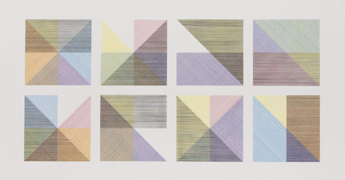
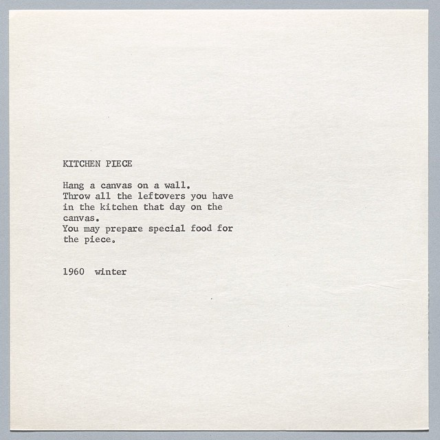
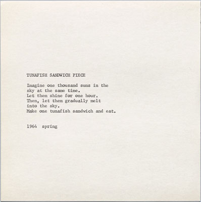

# Week 5 – Adding repetition

# Review

## ```mouseIsPressed``` and ```keyIsPressed```
In addition to ```mouseX``` and ```mouseY```, P5js gives us some other built-in variables that we can use to create user interaction:
- ```mouseIsPressed``` tells us if the mouse is currently being pressed, and
- ```keyIsPressed``` tells us if the any key is currently being pressed


```
function setup(){
    createCanvas(600,600);
}

function draw(){
    background(255);
    if(mouseIsPressed){
        ellipse(300,300, 50,50);
    }
}
```


```&&``` know as and

```
function setup(){
    createCanvas(600,600);

function draw(){
    background(255);
    if(mouseIsPressed && keyIsPressed){
        ellipse(300,300, 50,50);
    }
}
```

```||``` know as or

```
function setup(){
    createCanvas(600,600);
}

function draw(){
    background(255);
    if(mouseIsPressed || keyIsPressed){
        ellipse(300,300, 50,50);
    }
}
```

You can also compare numbers to create boolean operators: 

```<``` less than


```
function setup(){
    createCanvas(600,600);
}

function draw(){
    background(255);
    if(mouseX < width/2){
        ellipse(width/2,width/2, 50,50);
    }
}
```


```>``` greater than
  ```
function setup(){
    createCanvas(600,600);
}

function draw(){
    background(255);
    if(mouseX > width/2){
        ellipse(width/2,width/2, 50,50);
    }
}
```

```===``` equal to
```
let x;
let y;
function setup(){
    createCanvas(600,600);
    x = width/2;
    y = width/2;
}

function draw(){
    background(255)
    if(frameCount%10 === 1){
        x = (x + width/2/100) % width;
    }
    ellipse(x,y, 50,50);
}
```

```<=``` less than or equal
```
function setup(){
    createCanvas(600,600);
}

function draw(){
    background(255);
    if(mouseX <= width/2){
        ellipse(width/2,width/2, 50,50);
    }
}
```
```>=``` greater than or equal

```
function setup(){
    createCanvas(600,600);
}

function draw(){
    background(255);
    if(mouseX >= width/2){
      ellipse(width/2,width/2, 50,50);
    }
    rect(0, 0, 100, 100);
}
```

```!=``` not equal to

```
function setup(){
    createCanvas(600,600);
}

function draw(){
    background(255);
    if(mouseX != width/2){
      ellipse(width/2,width/2, 50,50);
    }
    rect(0, 0, 100, 100);
}
```

## Adding repetition

Today we will learn how to create repetition with our code. This is one of the most powerful concepts within software. So far this semester we have learned:

- how to create and use variables, to create a media object that can dynamically change,
- how to create interactive programs, that use dynamic variables to change in response to user input,
- and how to use conditionals to check for different situations within our code and render or respond to them differently.
- And all of these things are essential components of software.
- But repetition is another key concept that is at the core of what software does.

The kind of repetition that we are going to learn today allows you to write a program that does something hundreds, thousands, millions, or billions of times. Whenever you hear people talking about the power of software to proces "big data", or to search through billions of web pages, they are referencing the ability of software to implement some kind of repetition. It lets you write a piece code, and then repeat that an inhuman number of times.

### Creative inspiration
But first, let's consider some examples of related creative work that explores these kinds of forms, which we can draw on for inspiration this week.

### Sol Lewitt



Conceptual Art was a movement that rose to prominence in the 1960s, made popular by artists such as Sol Lewitt and Yoko Ono. This body of work put more emphasis on the idea or the concept of the artwork, more than the technical or material implementation or rendering. In Conceptual Art, the artwork was considered to be the idea itself, with various instantiations relegated to a lower priority, or ignored altogether.

As Sol Lewitt wrote in his essay "Paragraphs on Conceptual Art" (June 1967, Artforum) "When an artist uses a conceptual form of art, it means that all of the planning and decisions are made beforehand and the execution is a perfunctory affair. The idea becomes a machine that makes the art."

   
### Yoko Ono




If this idea sounds a lot like computer programming to you, you wouldn't be alone. Several digital artists have drawn inspiration from Conceptual Art to draw parallels in the ways that with software and other digital media, we often create machine configurations that themselves produce cultural objects.

In fact, one of the creators of Processing, Casey Reas, produced a 2004 Processing project related to Lewitt's work: {Software} Structures project at the Whitney, curated by Christiane Paul.

Beyond this general connection to software, this week we'll look at Sol Lewitt's work as an example of creative experimentation with formal pattern and repetition. This [video](https://www.youtube.com/watch?v=YvOpvam8CSM) documents a 2008 installion of his work at [MoMA](https://www.moma.org/calendar/exhibitions/305):

In addition to the way that Lewitt uses language to create something like a computer program to generate a drawing, let's also pay attention to the way that he uses logic, combinatorics, and repetition, rendered here in the form of a grid of geometric shapes.

There are several installations of Sol Lewitt's work throughout New York City. One of his line drawings was recently installed in the library at Pratt University in Brooklyn, which you could make arrangements to go see. Another huge colorful piece is at the 59th Street / Columbus Circle subway station. And another is in the lobby of 55 West 13th St (at Sixth Ave), on the campus of The New School.


- [zach.lieberman](https://www.instagram.com/zach.lieberman/)
- [Blobs](https://www.instagram.com/p/CWvQUEqrrlx/)

## while() loop
```
let i = 0;
while (i < 10) {
  text += "The number is " + i;
  print(text)
  i++;
}
```

So what this is saying is while this condition is true do what's in the code block over and over again until the conditional turns false.

So you can get yourself into trouble using while loops.  Just last week I was working on a script to programmatically setup the file structure of some post production comp pipelines.  I go myself into an infinite loop and kept creating new versions of a shot folder.  

but sometimes you need a while loop to be infinite, but this is usually outside of a development environment such as p5js. 

```
while(true){
    run your app;
}
```

```while``` loops are useful things but

lets look at some while loops:

```
let rect_width;
let rect_height;
let offset;
function setup(){
    createCanvas(512, 512);
    rect_width = 10;
    rect_height = height;
    offset = rect_width+5;
}
function draw(){
    let x = 10;
    while (x < width) {
        rect(x, 0, rect_width, rect_height);
        x = x + offset;
    }
}
```

let count how many rects we have and do something

```
let rect_width;
let rect_height;
let offset;
function setup(){
    createCanvas(512, 512);
    rect_width = 10;
    rect_height = height;
    offset = rect_width+5;
}
function draw(){
    let x = 10;
    let count = 0;
    while (x < width) {
        fill(count*255/(width/offset));
        rect(x, 0, rect_width, rect_height);
        x = x + offset;
        count += 1;
    }
}
```


```
let rect_width;
let rect_height;
let offset;
function setup(){
    createCanvas(512, 512);
    rect_width = 10;
    rect_height = height;
    offset = rect_width+5;
}
function draw(){
    let x = 10;
    let count = 0;
    while (x < (width-offset) && count < (width-offset)/offset) {
        fill(count*255/(width/offset));
        rect(x, 0, rect_width, rect_height);
        x = x + offset;
        count += 1;
    }
}
```


```
let rect_width;
let rect_height;
let offset;
function setup(){
    createCanvas(512, 512);
    rect_width = 10;
    rect_height = height;
    offset = rect_width;
    noStroke();
}
function draw(){
    let x = 10;
    let count = 0;
    while (x < width) {
        fill(count*255/(width/offset));
        rect(x, 0, rect_width, rect_height);
        x = x + offset;
        count += 1;
    }
}
```

```
let rect_width;
let rect_height;
let offset;
function setup(){
    createCanvas(512, 512);
    rect_width = 1;
    rect_height = height;
    offset = rect_width;
    noStroke();
}
function draw(){
    let x = 10;
    let count = 0;
    while (x < width) {
        fill(count*255/(width/offset));
        rect(x, 0, rect_width, rect_height);
        x = x + offset;
        count += 1;
    }
}
```


## 15-20 MIN TRYING THINGS OUT

```
let rect_width;
let rect_height;
let offset;
let index = 0;
function setup(){
    createCanvas(1024, 512);
    rect_width = 5;
    rect_height = height;
    offset = rect_width;
    // noStroke();
    
    rectMode(CENTER);
}
function draw(){
    background(255)
    let x = 10;
    let count = 0;
    let total_rect =  (width/2)/offset;
    index = frameCount % 500;
    translate(width/4, height/2);
    while (count < total_rect) {
        push();
        {
          translate(x, 0)
          if(index < 250)
            rotate(sin(count/total_rect*(TWO_PI)))
          if(index > 250)
            rotate(cos(count/total_rect*(TWO_PI)))
          fill(count*255/(width/offset), 100);
          stroke(255-count*255/(width/offset), 10); 
          rect(0, 0, rect_width, rect_height);
          x = x + offset;
          count += 1;
        }
        pop();
    }
}
```

## ```for()``` loops

```for``` loops are far more common than ```while``` loops because they are much less problematic.  They are kind of self contained packages that tell the computer how many times to loop.

so lets look at how a ```for``` loop is written

```
function setup() {
  createCanvas(400, 400);
}

function draw() {
  background(220);
  let some_number = 10;
  let rect_width = width/some_number;
  for(let i = 0; i < some_number; i++){
    fill(i*rect_width);
    rect(i*rect_width, 0, rect_width, height);
  }
}
```

```
function draw() {
  background(220);
  let some_number = 10;
  let rect_width = width/some_number;
  //Declare the var
  for(let i = 0; 
  //Compare the var
      i < some_number; 
  //Increment the var
      i+=5){
    fill(i*rect_width);
    rect(i*rect_width, 0, rect_width, height);
  }
}
```
```
function draw() {
  background(220);
  let some_number = 10;
  let rect_width = width/some_number;
  //Declare the var
  for(let i = 10; 
  //Compare the var
      i > 0; 
  //Increment the var
      i--){
    fill(i*rect_width);
    rect(i*rect_width, 0, rect_width, height);
  }
}
```

so this tells the computer that we are going to loop over the variable ```i``` until i is ```greater than``` ```>``` ```some_number``` every time we loop we are going to increment ```i``` by 1. 

```
//global vars
// the period length for our cycle
let cycle_period = 500;
// our counter
let i = 0;
// number of frames to loop time
let num_boxes = 3;
// box height
let box_height = 350;
// box width
let box_width = 350;
// alpha value
let alpha = 0;
// current animation value in radians 
let value = 0;

function setup() {
  //create the canvas the width and height of the window
  createCanvas(windowWidth, windowHeight);
  // set the stroke to white
  stroke(0, 255, 255);
  // lets uncomment to turn off strokes;
  // noStroke();
}

function draw() {
  //background(0, 0, 0)
  // we loop from i to the num_boxes
  for(let i = 0; i < num_boxes; i++){
  // We use our custom getValue() function 
  // to calculate a value that drives the animation
    value = (frameCount%cycle_period)/cycle_period*(2*PI);
    // we normalize our index between 0..1 by dividing i/num_boxes
    let c = i/num_boxes;
    // we create a sin wave using the value and our normalized index
    let j = sin(value+c);
    // we scale the wave by 10
    j *= 5;
    // we take the abs() value of the wave 0-1
    alpha = abs(j)
    // we call setColor passing in our index
    let red = 150+sin(value+c)*100;
    // our green value
    let green = 0;
    // our blue value
    let blue = 200+cos(value+c)*50;
    fill(red, green, blue, alpha);
    stroke(0, red, blue, 100+alpha);
    // we push/pop transform so that the transforms don't add/stack up
    // more on this later on when we talk about transforms in depth
    push();
    // we call draw rect with our index
    let x = -box_width * sin(value+c)/2;
    let y = -box_height * sin(value+c)/2
    let draw_box_width = box_width*sin(value+c);
    let draw_box_height = box_height*sin(value+c);
    translate(width/2, height/2);
    let r = map(i, 0, num_boxes, -1, 1)*2*PI;
    rotate(r+value);
    rect(x,y,draw_box_width,draw_box_height);
    // we pop our transform to close out our draw operation
    pop();
  }
}
```

```
//global vars
// the period length for our cycle
let cycle_period = 500;
// our counter
let i = 0;
// number of frames to loop time
let num_boxes = 3;
// box height
let box_height = 350;
// box width
let box_width = 350;
// alpha value
let alpha = 0;
// current animation value in radians 
let value = 0;

function setup() {
  //create the canvas the width and height of the window
  createCanvas(windowWidth, windowHeight);
  // set the stroke to white
  stroke(0, 255, 255);
  // lets uncomment to turn off strokes;
  // noStroke();
  rectMode(CENTER);
}

function draw() {
  background(255, 255, 255)
  // we loop from i to the num_boxes
  for(let i = 0; i < num_boxes; i++){
  // We use our custom getValue() function 
  // to calculate a value that drives the animation
    value = (frameCount%cycle_period)/cycle_period*(2*PI);
    // we normalize our index between 0..1 by dividing i/num_boxes
    let c = i/num_boxes;
    // we create a sin wave using the value and our normalized index
    let j = sin(value+c);
    // we scale the wave by 10
    j *= 5;
    // we take the abs() value of the wave 0-1
    alpha = abs(j)
    // we call setColor passing in our index
    let red = map(sin(value+c), -1, 1, 150, 255);
    // our green value
    let green = 0;
    // our blue value
    // let blue = 200+cos(value+c)*50;
    let blue = map(cos(value+c), -1, 1, 200, 250);
    fill(red, green, blue, alpha);
    stroke(0, red, blue, 100+alpha);
    // we push/pop transform so that the transforms don't add/stack up
    // more on this later on when we talk about transforms in depth
    push();
    // we call draw rect with our index
    let draw_box_width = box_width*sin(value+c);
    let draw_box_height = box_height*sin(value+c);
    translate(width/2, height/2);
    let r = map(i, 0, num_boxes, -TWO_PI, TWO_PI);
    rotate(r+value);
    rect(0,0,draw_box_width,draw_box_height);
    // we pop our transform to close out our draw operation
    pop();
  }
}
```


```
let img;
let doInvert = false;

// Load the image
function preload() {
  img = loadImage("assets/PRI_220306753.webp");
}

function setup() {
  createCanvas(img.width, img.height);
  
  // Resize the image to fit the canvas
  //img.resize(width, height);

  // Disable the stroke
  noStroke();

}

function draw() {
 
  // If we need to invert...
  if(doInvert){
    
    // Load the pixels
    img.loadPixels();
    let skip = 1;
    // Loop through the pixels X and Y
    for (let y = 0; y < img.height; y+=skip) {
      for (let x = 0; x < img.width; x+=skip) {

        // Calculate the pixel index
        const index = (y * img.width + x) * 4;

        // Get the red, green, and blue values
        const r = img.pixels[index + 0];
        const g = img.pixels[index + 1];
        const b = img.pixels[index + 2];
        
        // Invert the colors
        img.pixels[index + 0] = 255 - r;
        img.pixels[index + 1] = 255 - g;
        img.pixels[index + 2] = 255 - b;

      }
    }

    // We're finished working with pixels so update them
    img.updatePixels();
    
    // Don't do invert again until we set it to true on click
    doInvert = false;
  }
  
  // Draw the image 
  image(img, 0, 0);
  
}

function mousePressed(){
  
  // Invert the colors on click
  doInvert = true;
}
```


## 10-20 MIN TRYING THINGS OUT && BREAK

## Nested for() loops
```
let some_number = 10;
for(let i = 0; i < some_number; i++){
    for(let j = 0; j < some_number; j++){
        drawShapes(i, j);
    }
}
```

Lets look at how we can nest ```for``` loops to make a grid!


```
function setup() {
  createCanvas(512, 512);
  noStroke()
  let numSquares = 11;
  let squareWidth = width/numSquares;
  let squareHeight = height/numSquares;
  
  let count = 0;
  for(let x = 0; x < numSquares; x++){
    for(let y = 0; y < numSquares; y++){
      if(count%2 === 0)
        fill(255, 0, 255)
      else
        fill(255, 255, 0)
      rect(x*squareWidth, y*squareHeight, squareWidth, squareHeight);
      count++;
    }
  }
}
```

```
function setup() {
  createCanvas(512, 512);
  noStroke()
  let numSquares = 11;
  let squareWidth = width/numSquares;
  let squareHeight = height/numSquares;
  
  let count = 0;
  for(let x = 0; x < numSquares; x++){
    for(let y = 0; y < numSquares; y++){
      push();
      if(count%2 === 0)
        fill(255, 0, 255)
      else
        fill(255, 255, 0)
      translate(x*squareWidth, y*squareHeight);
      rect(0,0, squareWidth, squareHeight);
      pop();
      count++;
    }
  }
}
```


```
function setup() {
  createCanvas(512, 512);
  noStroke()
  let numSquares = 11;
  let squareWidth = width/numSquares;
  let squareHeight = height/numSquares;
  
  let count = 0;
  for(let x = 0; x < numSquares; x++){
    for(let y = 0; y < numSquares; y++){
      push();        
      translate(x*squareWidth, y*squareHeight);
      fill(255, 255, 0)
      rect(0,0, squareWidth/2, squareHeight/2);
      fill(255, 0, 255)
      circle(10, 10, squareWidth/2, squareHeight/2);
      pop();
    }
  }
}
```

## 10-20 MIN TRYING THINGS OUT && BREAK

## Comparing everything to everything else
```
let some_number = 10;
let list = [10, 9, 12, 25, 14, 4, 6, 10];
for(let i = 0; i < list.length; i++){
    for(let j = i; j < list.length; j++){
        compare(list[i], list[j])
    }
}
```
_So what does this tell the computer to do?_

_where is this useful?_ 
 * collision detection algorithms
 * particle systems repulsion algorithms 
 * map making
 * distance checking
 * #Stonks

## Home Work
  * Coding Assignment #4.a: Create a Endless animation using primitives: Circle, Square, Rectangle, Triangles
  * Coding Assignment #4.b: Create a Endless animation using found objects   
      * MEMEs will be judged by their Dankness
