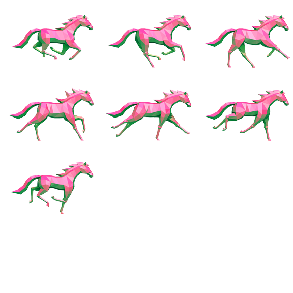

# Week 10 – Advanced Coding in P5JS
* An Introduction to Classes
* Loading JSON
* Visualizing Data
* Think about Your Final Projects


# MIDTERM PROJECTS


# HOME WORK


## BREAK

# Classes

A class is declared by using the ```class``` keyword.

```
class MyCustomCircle {
  constructor(width){
    
  }
}
```

You can assign variables to the class instance by using the ```this.``` keyword.

```
class MyCustomCircle {
  constructor(width){
    this.width = width;
  }
}
```

we can give it functions that we can call like its own ```draw``` function;

```
class MyCustomCircle {
  constructor(width){
    this.width = width;
  }

  draw(x, y){
    push();
    {
      translate(x, y);
      circle(0, 0, width);
    }
    pop();
  }
}
```

So let look at a more complex example:

```
// Bubble class
class Bubble {
  constructor(x, y, diameter, name) {
    this.x = x;
    this.y = y;
    this.diameter = diameter;
    this.radius = diameter / 2;
    this.name = name;
    this.over = false;
  }

  // Check if mouse is over the bubble
  rollover(px, py) {
    let d = dist(px, py, this.x, this.y);
    this.over = d < this.radius;
  }

  // Display the Bubble
  display() {
    stroke(0);
    strokeWeight(0.8);
    noFill();
    ellipse(this.x, this.y, this.diameter, this.diameter);
    if (this.over) {
      fill(0);
      textAlign(CENTER);
      text(this.name, this.x, this.y + this.radius + 20);
    }
  }
}

let data = {}; // Global object to hold results from the loadJSON call
let bubbles = []; // Global array to hold all bubble objects

// Put any asynchronous data loading in preload to complete before "setup" is run
function preload() {
  data = loadJSON('assets/bubbles.json');
}

// Convert saved Bubble data into Bubble Objects
function loadData() {
  let bubbleData = data['bubbles'];
  for (let i = 0; i < bubbleData.length; i++) {
    // Get each object in the array
    let bubble = bubbleData[i];
    // Get a position object
    let position = bubble['position'];
    // Get x,y from position
    let x = position['x'];
    let y = position['y'];

    // Get diameter and label
    let diameter = bubble['diameter'];
    let label = bubble['label'];

    // Put object in array
    bubbles.push(new Bubble(x, y, diameter, label));
  }
}

// Create a new Bubble each time the mouse is clicked.
function mousePressed() {
  // Add diameter and label to bubble
  let diameter = random(40, 80);
  let label = 'New Label';

  // Append the new JSON bubble object to the array
  bubbles.push(new Bubble(mouseX, mouseY, diameter, label));

  // Prune Bubble Count if there are too many
  if (bubbles.length > 10) {
    bubbles.shift(); // remove first item from array
  }
}

function setup() {
  createCanvas(640, 360);
  loadData();
}

function draw() {
  background(255);

  // Display all bubbles
  for (let i = 0; i < bubbles.length; i++) {
    bubbles[i].display();
    bubbles[i].rollover(mouseX, mouseY);
  }

  // Label directions at bottom
  textAlign(LEFT);
  fill(0);
  text('Click to add bubbles.', 10, height - 10);
}
```


```
// Daniel Shiffman
// http://youtube.com/thecodingtrain
// https://thecodingtrain.com/CodingChallenges/111-animated-sprite.html

// Horse Spritesheet from
// https://opengameart.org/content/2d-platformer-art-assets-from-horse-of-spring

// Animated Sprite
// https://youtu.be/3noMeuufLZY

let spritesheet;
let spritedata;

let animation = [];

let horses = [];

function preload() {
  spritedata = loadJSON('horse.json');
  spritesheet = loadImage('horse.png');
}

function setup() {
  createCanvas(640, 480);
  let frames = spritedata.frames;
  for (let i = 0; i < frames.length; i++) {
    let pos = frames[i].position;
    let img = spritesheet.get(pos.x, pos.y, pos.w, pos.h);
    animation.push(img);
  }

  for (let i = 0; i < 5; i++) {
    horses[i] = new Sprite(animation, 0, i * 75, random(0.1, 0.4));
  }
}

function draw() {
  background(0);

  for (let horse of horses) {
    horse.show();
    horse.animate();
  }
}
```

Let Look at the class ```Sprite```

```
// Daniel Shiffman
// http://youtube.com/thecodingtrain
// https://thecodingtrain.com/CodingChallenges/111-animated-sprite.html

// Horse Spritesheet from
// https://opengameart.org/content/2d-platformer-art-assets-from-horse-of-spring

// Animated Sprite
// https://youtu.be/3noMeuufLZY

class Sprite {
  constructor(animation, x, y, speed) {
    this.x = x;
    this.y = y;
    this.animation = animation;
    this.w = this.animation[0].width;
    this.len = this.animation.length;
    this.speed = speed;
    this.index = 0;
  }

  show() {
    let index = floor(this.index) % this.len;
    image(this.animation[index], this.x, this.y);
  }

  animate() {
    this.index += this.speed;
    this.x += this.speed * 15;

    if (this.x > width) {
      this.x = -this.w;
    }
  }
}
```

Let's look at the image



Let's look at the ```JSON```

## Loading JSON

```
{
  "frames": [{
      "name": "sprite-00",
      "position": {
        "x": 0,
        "y": 0,
        "w": 192,
        "h": 144
      }
    },
    {
      "name": "sprite-01",
      "position": {
        "x": 192,
        "y": 0,
        "w": 192,
        "h": 144
      }
    },
    {
      "name": "sprite-02",
      "position": {
        "x": 384,
        "y": 0,
        "w": 192,
        "h": 144
      }
    },
    {
      "name": "sprite-03",
      "position": {
        "x": 0,
        "y": 144,
        "w": 192,
        "h": 144
      }
    },
    {
      "name": "sprite-04",
      "position": {
        "x": 192,
        "y": 144,
        "w": 192,
        "h": 144
      }
    },
    {
      "name": "sprite-05",
      "position": {
        "x": 384,
        "y": 144,
        "w": 192,
        "h": 144
      }
    },
    {
      "name": "sprite-06",
      "position": {
        "x": 0,
        "y": 288,
        "w": 192,
        "h": 144
      }
    }
  ]
}
```

# DATA DATA DATA


Let's look at some data and live code a bit.

```examples/data/population.json```

big data is messy

[turnstiles json](https://drive.google.com/file/d/1jkgEA9z3LP5lBLmQUrfOmZh93OcRJMmi/view?usp=sharing)
[turnstiles csv](https://drive.google.com/file/d/1JEJdLVgc6RS59oHmo_Z_Sj6XFORZ-xJj/view?usp=sharing)
### Home Work
* Coding Assignment #6: Data Viz Using data from https://opendata.cityofnewyork.us/
