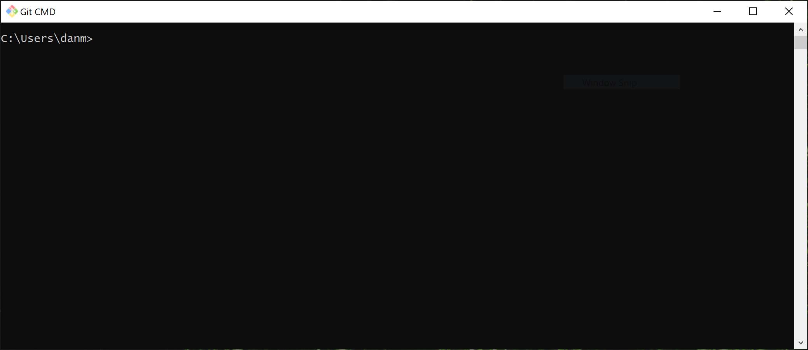
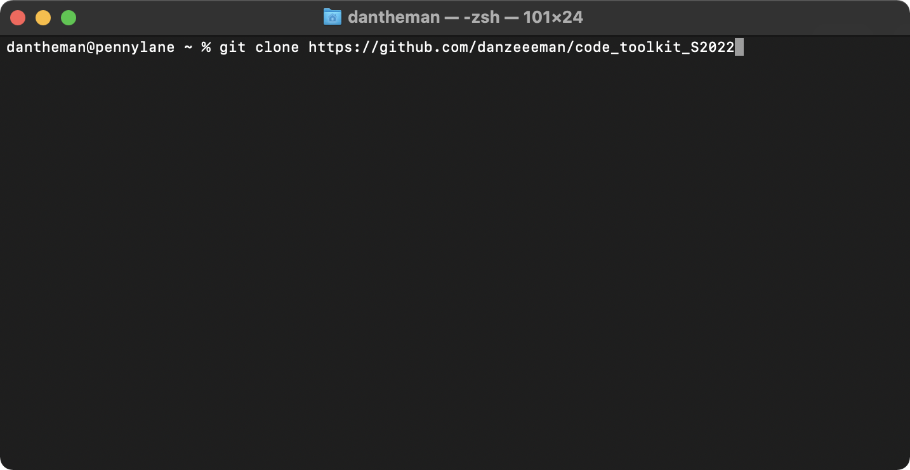

# _A crash course to git_
- Create a [Github](https://github.com) profile 
- Install Git
  - On Windows 
    - Install [git](https://git-scm.com)
    - open git-cmd [see screen shot] 
    - go to cloning
  - on Mac 
    - install [brew](https://brew.sh)
    - open terminal 
    - install git
      - type ```brew install git``` into your terminal
    - go to cloning
  - Clone the repo: 
    - type ```git clone https://github.com/danzeeeman/code_toolkit_S2022``` into the terminal

```
git clone your_repo_url
```

Cloning a repository of code is basically making a copy but with 
- Copy the _template_ folder and rename it to your chosen name
```
git add path_your_new_file_folder_name/*
git commit -a -m "adding my homework folder where I will store all of my homework"
git push origin main
```
### we might run into a little issue here!
