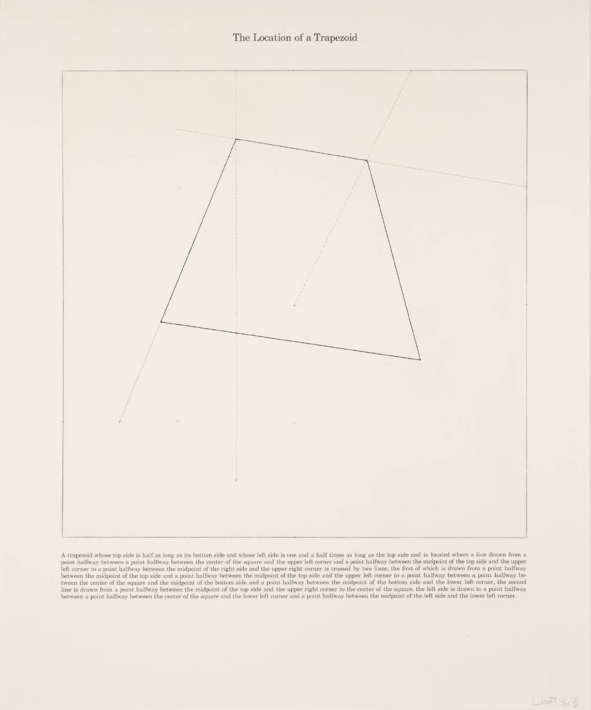

## Code Toolkit: Javascript and P5JS, Spring 2022 – LCOD 2010 – Dan Moore

### Introductory Beep Boops

* Who: Dan Moore, dan@makeitdoathing.com

* What: Code Toolkit: Javascript and P5.JS, Spring 2022 – LCOD 2010

* When: Tuesday, 4:00 – 6:40pm

* Where: 6 East 16th Street Room: 605

### Office hours: Tuesday, 2-4pm or by Zoom as needed (email me and we can set something up)

This course provides a basic introduction to coding for students with no prior experience using the P5.js Javascript Programing Environment. It will introduce the use of computing and algorithms to web adesign, data analysis and visualization, and game design. Students will complete integrative projects within each of these areas, and leave the class with a strong foundation in the use of P5js across a range of applications. Access to a working laptop will be expected throughout the semester. This course fulfills the Integrative Course requirement of the Culture and Media major.

## Class Github & Email

Rather than using Canvas this semester we will be using this [github repo](https://github.com/danzeeeman/code_toolkit_S2022).  ___Please bookmark that URL and refer back to it often___. 

All deadlines, reading materials, project tutorials, and other course materials will be posted here on the github. You will be using Google Docs, Google Drive, and other platforms to submit your project work and reading responses. The repo will include links to these resources and instructions on how to submit work.

Please check this repo as well as your @newschool.edu email regularly for any course announcements, possibly including last minute updates.

## Course Structure

We will usually begin class by reviewing the previous week’s homework, showing examples of student work and addressing any questions that came up. Then I will offer an interactive lecture on new coding topics. Approximately every other week we will spend 30-40 minutes of class time on conceptual material and reading discussion. We will take a short break halfway through class. Sometimes I can forget – please remind me!

### Final Grade Calculation

* Weekly homework assignments 30% 

* Readings and reading discussions 15% 

* Midterm project 20% 

* Final project 20% 

* Participation 15%

All assignments will be completed individually. Your participation grade is based on class discussions,

contributions to student work sharing, and questions via office hours and email. 

# Course Requirements & Assignments

## Weekly homework exercises

You will have weekly homework assignments comprised of coding exercises. They will be due the morning before class on Tuesday at 12pm, and you will submit as a zip to my New School Email address ```moored1@newschool.edu```.  Homeworks will be graded as pass/fail, on a scale of 0 or 1, based on effort. You will not be evaluated weekly on whether your code runs perfectly or has bugs, but rather on whether you engaged the topic and made progress. Occasionally I may give a fraction of a point (e.g. .85) to indicate that the level of completeness is not quite enough. Late submissions will be marked down, but submitting something is always better than submitting nothing, even if late. I will try my best to keep on posting homework grades throughout the semester, but if I fall behind, at the time of the midterm and final I will get caught up so you know where you stand. If at any time you would like more feedback * about one piece of work specifically or about your standing in the class overall * ___please do not hesitate to ask___.

Even though the weekly homework is mainly graded pass/fail, notice from the Final Grade Calculation above that it represents the largest fraction of your final grade. The best way to do well in terms of grading will be to keep up with the weekly homework, and if you don’t keep up with the homework it will be difficult to end up with a high grade. The reason I’ve structured things this way is because I have found that the best way for you to do well in terms of learning is also to keep up with the weekly homework. Our semester will proceed through small steps, but we’ll take those steps fairly quickly, and the topics will be like incremental blocks that build on each other, so make sure you understand the concept each week in order to be sure next week will make sense.

## Readings and reading responses

We also have readings and videos about every week weeks. These are indicated in the course schedule below and will be posted to the class github. You will be asked to submit a short reading response of about 150 words that mainly consists of quotes from the text that you wish to highlight and some questions or comments based on those passages. These will be submitted in a shared [Google Doc](https://docs.google.com/document/d/1EVALM_XbkDWo0Y4u45wBYwqAE9h1CCWQFeBrmGzN7p8). I will also pose questions in the Google Doc to serve as a prompt to guide your reading and responses. Like the weekly programming exercises, these will also be due at 12pm the morning before class and will also be graded pass/fail.

## [READING DISCUSSION GOOGLE DOC](https://docs.google.com/document/d/1mZeyjKicprIcDLHriPR3u19A-r9DTYlfPIC0iXvcp58)

### Projects

There will be two projects to complete: a midterm due around week 10, and a final due at the end of the semester. Each project will begin with a 1 page planning document, and will conclude with an accompanying 1-2 page report explaining your work, your intentions, challenges you faced, diagrams and planning material, and explanations of your code. The midterm project will offer you a choice between an interactive non-linear narrative, a game, or a data visualization. The final project will be an open ended project on a topic of your choosing using the technology of your choosing. More specific details about the final project assignments will be provided later in the semester as I gage the class's progress.

Projects will be graded based on how well they fulfill the formal requirements stated in the project assignment, and the degree to which they engage with theoretical concepts from readings and discussion. In other words, while the reading discussions are a way to process, digest, and comprehend the readings, the projects are a way to demonstrate an understanding of those readings, and will be graded as such. We won’t have any essays or written assignments in this class, in place of this, I would like your project work and write-ups to be a product of your engagement with course concepts both technical and theoretical.

## Learning Outcomes

After successful completion of this course, students will:

1. have gained a deep understanding of the fundamental concepts of modern computer programs, which may serve as a solid foundation from which to continue learning;

2. have gained deep insight into precisely how digital machinery operates when it mediates the socio* cultural patterns of life today, including: design and visual culture, communication, games, economic transactions, social interaction, and others;

3. understand software elements such as data types and data structures, including the difference between the two, examples of each, and how to determine which examples to use in a specific situation;

4. understand the computer science principle of abstraction, including how to use certain program structures to create modular, reusable code that reduces complexity by hiding implementation details;

5. have learned the principles of interactive computer programming, including how write code that is triggered by and responds to user actions and events;

6. have learned how digital software can be arranged into a system or separate and discrete components or independent processes, which can interact with each other through network protocols, and client/server architectures;

7. develop critical computer science skills, understanding how all the above concepts are situated within a political and socio-cultural landscape;

8. have gained a set of skills that may be applied to other parts of their liberal arts education as quantitative research methods, data investigation and visualization, and algorithmic analysis;

9. have read a lot, learned a lot, made a lot of stuff, and had a lot of fun.

Course readings & materials

Lecture notes: I will post my notes in the the repo and will treat is as a living document. 

All readings will be provided via the repo or links to files. There are no required textbooks to purchase for this course.

Links to other tools, platforms, references, and other online documentation will be posted to to the repo.

You will need access to a laptop for the duration of the course to complete the projects. If this creates any hardship for you please let me know and I can connect you with resources on campus.

## General Mask Statement

The New School has implemented policies and guidance intended to support the health and safety of the university community. Mask wearing protects others, not just the wearer. All students, faculty and staff are asked to respect our entire community by abiding by university policies at any given time. New School community members who observe others not abiding by these expectations may gently remind them to respect our community health.

## Attendance and Meaningful Participation for an Online Course

Attendance and participation are required. Failing to show up and take part may result in a lowered grade, and excessive lack of engagement may result in being dropped from the course. Of course, we find ourselves in strange and challenging times! Safety protocols this semester dictate that we all must get tested frequently and positive test results of ourselves or our personal contacts may result in quarantine or isolation.

If students or I are unable to attend class, we may need to use Zoom either to record classes for others to watch later (asynchronously), or to conduct class discussions or lessons together (synchronously). It may happen that some us may be live in person, while others are connecting over the internet. Please be flexible, compassionate, generous, and kind as we navigate these difficult arrangements.

Please keep in mind that you are responsible for any assignment deadlines even in the event of an absence. Please check with your peers, the class website, and me regarding anything you miss due to absence.

I warmly recognize that not everyone feels as comfortable vocally participating in class situations – and masks will likely make speaking even more difficult than usual. I implore you to keep in mind that your position and perspectives are unique and valuable, and that the class and I will always benefit from your voice and contributions. In short: I always want to hear what you have to say, and your classmates will benefit from it as well. Please speak up – and try your best to make yourself heard through your mask!

## Resources

The university provides many resources to help students achieve academic and artistic excellence. These resources include:

* University Libraries: http://library.newschool.edu

* University Learning Center: http://www.newschool.edu/learning-center

* University Disabilities Service: www.newschool.edu/student-disability-services/

* I am more than happy to ensure any required accommodations for any students with accessibility issues are met. Any student who has needs or concerns about academic accommodations is welcome to meet with me privately. All conversations will be kept confidential. Students requesting any accommodations will also need to contact Student Disability Service (SDS). SDS will conduct an intake and, if appropriate, the Director will provide an academic accommodation notification letter for you to bring to me. At that point, I will review the letter with you and discuss these accommodations in relation to this course. While I am sympathetic to everyone’s different abilities, I cannot make exceptional accommodations without you first contacting SDS.

* Student Ombuds: https://www.newschool.edu/student-advocacy/conflict-resolution/

The Student Ombuds office provides students assistance in resolving conflicts, disputes or complaints on an informal basis. This office is independent, neutral, and confidential.

* Office of Financial Aid: https://www.newschool.edu/financial-aid/

During this online semester, financial aid staff remain available by email, phone, and Google Hangout Monday through Friday from 9:00 a.m. to 5:00 p.m. You can also make a virtual appointment with staff via Starfish.

Eligible students may be considered for different types of financial aid such as scholarships, federal grants, federal work study and federal student loans. To be considered for federal student aid, you will need to complete the Free Application for Federal Student Aid (FAFSA) available online at fafsa.gov. The FAFSA is available starting October 1. The New School’s priority deadline to submit the FAFSA is February 15. The FAFSA needs to be submitted annually.

University and College Policies

Academic honesty, plagiarism ... and computer programming and open source software

Compromising your academic integrity may lead to serious consequences, including (but not limited to) one or more of the following: failure of the assignment, failure of the course, academic warning, disciplinary probation, suspension from the university, or dismissal from the university.

Students are responsible for understanding the University’s policy on academic honesty and integrity and must make use of proper citations of sources for writing papers, creating, presenting, and performing their work, taking examinations, and doing research. It is the responsibility of students to learn the procedures specific to their discipline for correctly and appropriately differentiating their own work from that of others. The full text of the policy, including adjudication procedures, is found at http://www.newschool.edu/policies/

Resources regarding what plagiarism is and how to avoid it can be found on the Learning Center’s website: http://www.newschool.edu/university-learning-center/avoiding-plagiarism.pdf

All of that said, software development work and coding almost always involve the appropriation and collaging of other people’s code. Learning computer programming often entails modifying working examples rather than starting from scratch. In this class we are participating in communities of shared practices. However, any work you borrow and/or modify must be labeled as such. If you find sample code and integrate it into your work, this must be clearly and obviously indicated as such. Use comments for this purpose (i.e. # like this or “”” or like this “””). When attributing code from others in work that you're submitting, clearly indicate the name of the author or a source URL, and make clear which lines of code are not yours.

You will not be graded down for integrating other people’s work into your own. In fact, integrating the code of others is often more challenging than writing your own. However, I wish to review and comment on the work that you do, so this must be clearly indicated. Failure to do so will be considered the same as any other breach of academic integrity.

Intellectual property rights

http://www.newschool.edu/provost/accreditation-policies/

Grade policies

http://www.newschool.edu/registrar/academic-policies/

Student code of conduct

https://www.newschool.edu/student-conduct/

## Student Course Ratings

During the last two weeks of the semester, students are asked to provide feedback for each of their courses through an online survey. They cannot view grades until providing feedback or officially declining to do so. Course evaluations are a vital space where students can speak about the learning experience. It is an important process which provides valuable data about the successful delivery and support of a course or topic to both the faculty and administrators. Instructors rely on course rating surveys for feedback on the course and teaching methods, so they can understand what aspects of the class are most successful in teaching students, and what aspects might be improved or changed in future. Without this information, it can be difficult for an instructor to reflect upon and improve teaching methods and course design. In addition, program/department chairs and other administrators review course surveys. Instructions are available online at

http://www.newschool.edu/provost/course-evaluations-student-instructions.pdf

# [Schedule](Schedule.md) 

## Week 1 – Thinking like a computer?

  * Introductions
  * About the course
  * What is a software?
  * Computing, Outside a School of ___Computer Science___
  * How we Work: The P5js Development Environment ("PDE")
  * Drawing with numbers
  * The window as a grid of pixels
  * Loading Images


### Home Work

* Read Marshall McCluhan's [The Medium is the Message](pdfs/mcluhan.mediummessage.pdf)
* _Extra Credit_
  * The Critical Engineering Working Group's [THE CRITICAL ENGINEERING MANIFESTO](https://criticalengineering.org) [pdf](https://criticalengineering.org/ce.pdf)
  * Watch Zach Lieberman's talk at EYE0 2012 * https://vimeo.com/47203759?t=38m22s
  * Read Casey Reas et al. [{Sofrware} Structures](https://artport.whitney.org/commissions/softwarestructures/text.html#structure)

## Week 2 – Adding variance

* Variables
* Arithmetic (+, -, *, /, %)
* Introduction to ```random()```

### Home Work

* Coding Assignment #1 __Solve LeWitt's Trapezoid__ 

* Read Lev Manovich's [The Language of New Media, Cambridge, MA: MIT Press, 2002. Chapter 1 (pages 18-55)](https://dss-edit.com/plu/Manovich-Lev_The_Language_of_the_New_Media.pdf)

## Week 3 – Adding interactivity

* ```function draw()```
* Debugging
* Mouse Interaction
* ```map()``` function

### Home Work

* Read [Introduction to Shape Grammars](pdfs/MIT4_540F18_qa1.pdf)
* Coding Assignment #2a : Create a generative pattern
  * Experiment with 2D transforms such as scaling, rotation, mirroring
  * Iterate on your designs
  * Use Plenty of Variables
* Coding Assignment #2b : Make your pattern respond to the mouse input (button click and or position)

## Week 4 – Making things move

* Conditionals if and else
* Keyboard interaction * Motion
* Keeping Time 

### Home Work

* Coding Assignment #3 : A Clock
* Reading Selections from Matthew Fuller, [Software Studies: A Lexicon: Introduction, "Algorithm", "Code", "Programmability", and "Source Code".](https://monoskop.org/images/a/a1/Fuller_Matthew_ed_Software_Studies_A_Lexicon.pdf)

## Midterm project assignment

Link to be posted later

Due: Week 8 for in-class presentation and discussion

## Week 5 – Adding repetition

* for() loops

### Home Work

  * Coding Assignment #4.a: Create a Endless animation using primitives: Circle, Square, Rectangle, Triangles
  * Coding Assignment #4.b: Create a Endless animation using found objects   
      * MEMEs will be judged by their Dankness

## Week 6 – Timing and State

* Timing and Easing 
* State: a new way to use variables

### Home Work

* Coding Assignment #5: One Button Game
* "Data Visualization", from Matthew Fuller's Software Studies: A Lexicon
* Catherine D'Ignazio and Lauren Klein, ["Unicorns, Janitors, Ninjas, Wizards, and Rock

Stars"](https://monoskop.org/images/a/a1/Fuller_Matthew_ed_Software_Studies_A_Lexicon.pdf)

## Week 7 – Working with many things (lists), and modularity (functions)

* Data structures: Lists, Maps
* Functions: for project planning, reusability and modularity
* Data Structures and Data Visualization
  * CSV and JSON

### Home Work

* Coding Assignment #6: Data Self-Portrait 

## Week 8 – Midterm project work and review as needed

* Review & midterm project work

### Home Work

* Claus Pias, [“The Game Player’s Duty: The User as the Gestalt of the Ports”, from Media Archaeology: Approaches, Applications, Implications, Jussi Parikka and Erkki Huhtamo, eds.](pdfs/huhtamo-parikka-media_arch.pdf)

* Extra Credit Alex Galloway, ["Gamic Action, Four Moments", chapter 1 (pages 1-38) from Gaming: Essays on Algorithmic Culture.](pdfs/galloway_gamicaction.pdf)

## Week 9 – Midterm project presentations and discussion

* Midterm project presentations

### Home Work

* Final project Due: Week 15 – Final projects, Pitches due next week!

## Week 10 – Coding Outside of p5.js

* An Introduction to ES6 Javascript
* P5JS Libraries 
* Pitch Your Final Projects

### Home Work

* Coding Assignment #6: 

## Week 11 - Special Topics

* Special Topics in Coding Node.js

### Home Work

* Paul Dourish, “Protocols, Packets, and Proximity: The Materiality of Internet Routing”, from Signal Traffic: Critical Studies of Media Infrastructures, Nicole Starosielski and Lisa Parks, eds.

## Week 12 - Special Topics

* Bots and Scraping
* Machine Learning Basics

### Home Work

* Coding Assignment #7: Using Node.js create a bot
* Alex Galloway and Eugene Thacker, "Protocol and Counter-Protocol", 2003

## Week 13 - Special Topics

* Special Topics in Coding
* Final Project Check Point - Gut Check 

## Week 14 – Review

* Course material review & project work-session

## Week 15 – Final projects

* Final project presentations and discussion
