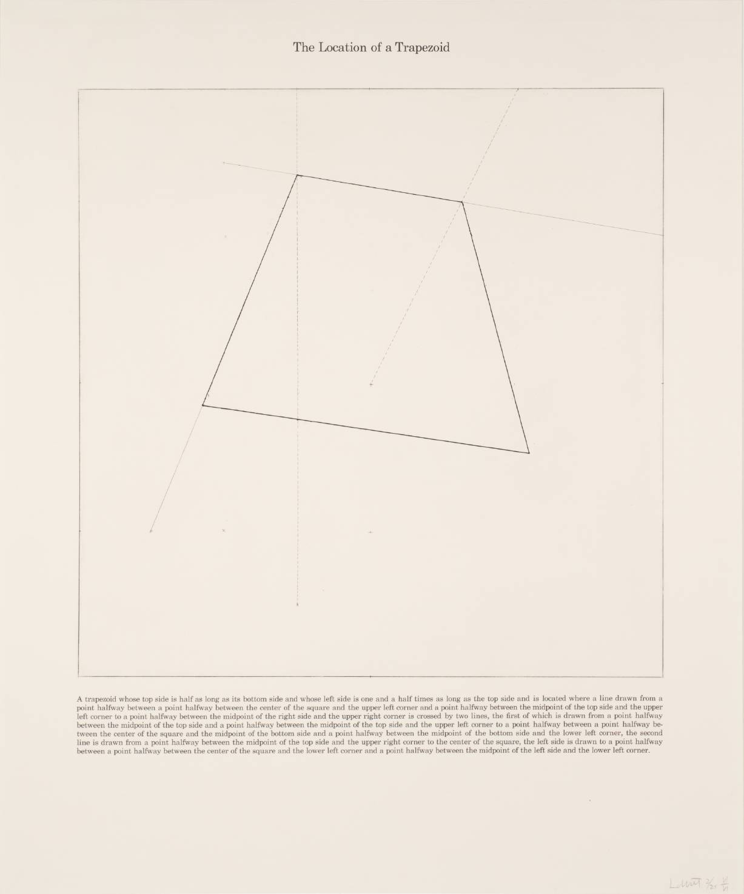

# Week 2 – Adding variance

## Variables
## Arithmetic
## functions() and methods()

* [Hello Variables](https://editor.p5js.org/danzeeeman/sketches/kAGXxWYRf)
  

# Homework
* Read Lev Manovich's [The Language of New Media, Cambridge, MA: MIT Press, 2002. Chapter 1 (pages 18-55)](pdfs/Manovich-Lev_The_Language_of_the_New_Media.pdf)
* Coding Assignment #1 __Solve LeWitt's Trapezoid__ 

